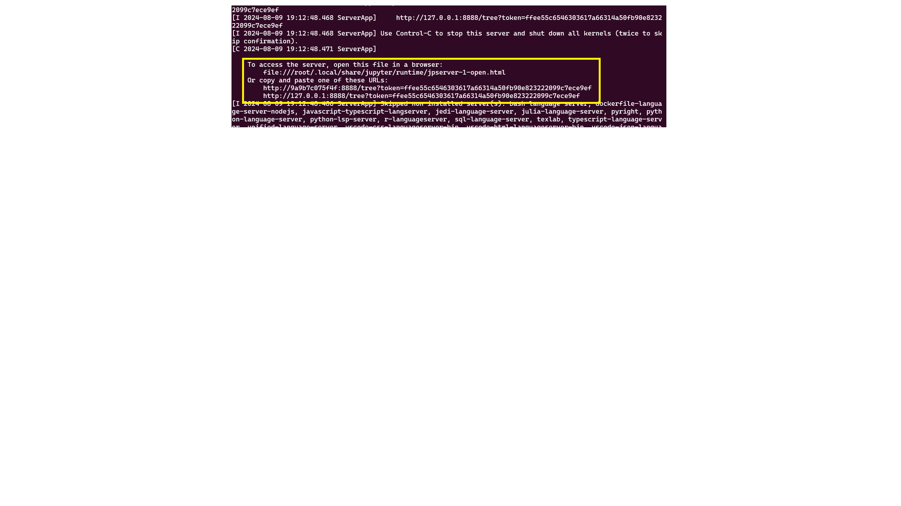
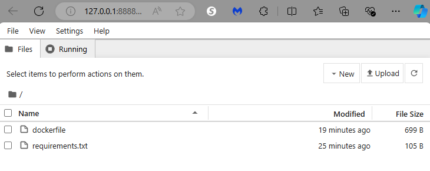

# Set up development computer with Docker, Jupyter

This article assumes you are using python to start a generic Jupyter notebook and then loading the requirements using requirements.txt file.

We recommend using conda as base and adding your dependencies using environment.yml. The conda packaging provides a better dependency than using pip.

| The first two bullet points of conda are really what make it advantageous over pip for many packages. Since pip installs from source, it can be painful to install things with it if you are unable to compile the source code (this is especially true on Windows, but it can even be true on Linux if the packages have some difficult C or FORTRAN library dependencies). conda installs from binary, meaning that someone (e.g., Continuum) has already done the hard work of compiling the package, and so the installation is easy.

## Prerequisites

You will need:

- Docker installed
- Visual Studio Code installed
- WSL terminal

If you want to run a GPU on your notebook, you will need the GPU drivers installed.

## Project setup

Start WSL and then create a directory where you want to put the project.

```bash
cd ~
mkdir dockerproject
cd dockerproject
code .
```

Create a readme.md for your project.

## Test Docker

Start Docker

```bash
sudo service docker start
```

Then try:

```bash
docker run hello-world
```

If you see

```
docker: permission denied while trying to connect to the Docker daemon socket at unix:///var/run/docker.sock: Head "http://%2Fvar%2Frun%2Fdocker.sock/_ping": dial unix /var/run/docker.sock: connect: permission denied.
See 'docker run --help'.
```

Set up your user:

```bash
# Create the docker group if it does not exist
sudo groupadd docker

# Add your user to the docker group.
sudo usermod -aG docker $USER

# Log in to the new docker group (to avoid having to log out / log in again; 
# but if not enough, try to reboot)
newgrp docker

# Check docker again
docker run hello-world
```

If you still get an error, reboot:

```bash
reboot
```

## Create the dockerfile

Start `code .` and open Visual Studio Code.

In the project directory, create a file named `dockerfile` with the following content:

```dockerfile
# Use an official Python runtime as a parent image
FROM python:3.8
# Set the working directory to /app
WORKDIR /app
# Install Jupyter Notebook
RUN pip install jupyter
# Make port 8888 available to the world outside this container
EXPOSE 8888
# Define environment variable
ENV NAME World
# Run Jupyter Notebook when the container launches
CMD ["jupyter", "notebook", "--ip=0.0.0.0", "--port=8888", "--no-browser", "--allow-root"]
```

## Create a requirements.txt file (as needed)

Use Visual Studio Code to create a file named `requirements.txt` listing them.

For example:

```text
numpy==1.25.2
pandas==1.5.3
matplotlib==3.7.1
seaborn==0.13.1
scikit-learn==1.2.2
sklearn-pandas==2.2.0
matplotlib
```

Then you can add the following code to your `Dockerfile` to run the requirements.

```dockerfile
# Set the working directory to /app
WORKDIR /app
# Copy the current directory contents into the container at /app
COPY . /app
# Install any needed packages specified in requirements.txt
RUN pip install --no-cache-dir -r requirements.txt
```

## Build Docker image

Open a terminal, navigate to the project directory, and run the following command to build the Docker image:

```bash
docker build -t my-jupyter .
```

## Run the Docker container

Once the image is built, run the command to run the container.

```bash
docker run -p 8888:8888 my-jupyter
```

Click on the https://127.0.0.1:8888 link. It has the code to log into Jupyter notebook



## Create your notebook on your local computer

You are logged into the notebook from the startup directory on your development computer.



## Run the container with environment variables

In many cases, you may want to pass in a token or API key when running the notebook. First set up the variables and export. Then you can start the container:

```
docker run -p 8888:8888 -e MUSICPREFERENCE='rockandroll'  my-jupyter
```

Inside the notebook, to see the environment variable, run:

```
!TODO
```

## Tips

- If your project has specific Python packages, list them in the `requirements.txt` file.
- Customize the Dockerfile based on your project requirements.
- Ensure Docker is running and the Docker daemon is accessible.
- If port 8888 is unavailable, choose a different port in the `docker run` command (e.g., `-p 8889:8888`).

## Summary of Docker commands

Summary of Docker commands:

- `docker build -t <my-image-name>` to build the Docker Image
- `docker run -d --name <my-container-name> <my-image-name>` to build the Docker Container
- `docker images` to display the list of created images
- `docker ps -a` to show the list of containers
- `docker rmi <my-image-id>` to remove an image
- `docker stop <my-container-id>` to stop a running container
- `docker rm <my-container-id>` to remove a stopped container

## Reference

See:

- [Setting Up and Running Jupyter Notebook in a Docker Container](https://medium.com/@18bhavyasharma/setting-up-and-running-jupyter-notebook-in-a-docker-container-d2acd713ce66)
- [How to fix docker: Got permission denied issue](https://stackoverflow.com/questions/48957195/how-to-fix-docker-got-permission-denied-issue)