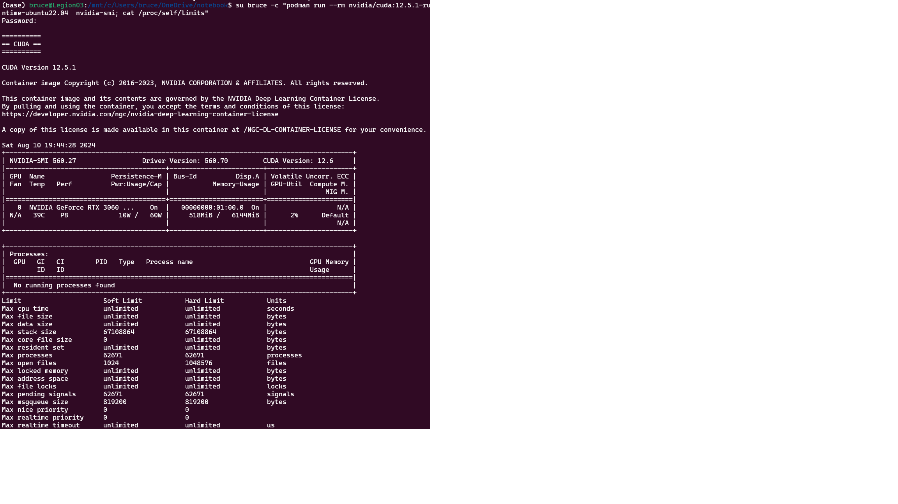

# How to set up GPU development for containers with Podman

In this article, learn how to set up your GPU development environment to run inside Podman. Most users can simply alias Docker to Podman (`alias docker=podman`) without any problems.

Podman supports the **Container Device Interface**.

The following is a compilation from sources, bug reports, GitHub repos that worked when I tried it on my laptop. Special thanks to [henrymai](https://github.com/henrymai) who's [README](https://github.com/henrymai/podman_wsl2_cuda_rootless?tab=readme-ov-file#setup-podman-for-wsl2-with-cuda-support-rootless) was significant help.

## Definitions

- [Podman](https://podman.io/docs) is a utility so you can create and maintain containers. Podman is a daemonless, open source, Linux native tool designed to make it easy to find, run, build, share and deploy applications using Open Containers Initiative (OCI) Containers and Container Images. See [What is Podman](https://docs.podman.io/en/latest/),
- **CDI** is an open specification for container runtimes that abstracts what access to a device, such as an NVIDIA GPU, means, and standardizes access across container runtimes. Popular container runtimes can read and process the specification to ensure that a device is available in a container. CDI simplifies adding support for devices such as NVIDIA GPUs because the specification is applicable to all container runtimes that support CDI.

## Prerequisites

You will need to have:

- Laptop or desktop with GPU
- Device drivers installed
- **WSL** installed. (I installed a fresh distribution of Ubuntu.)
- Visual Studio Code (or other Linux text editor)
- The username

To check the version you have installed use:

```
podman --version
```

See [Install NVIDIA GPU display driver](./setupnvidiadriver.md) for details.

## Upgrade Ubuntu

```
sudo apt update && sudo apt upgrade

# get release version
ubuntu_release=lsb_release -r
$ubuntu_release
```

## Install podman

You will also need Podman installed. Start **WSL**, then run

```bash
sudo apt remove docker docker-engine docker.io containerd runc
sudo apt install --no-install-recommends apt-transport-https ca-certificates curl gnupg2
sudo apt -y install podman
podman version
```

You should see something like this:

```text
WARN[0000] "/" is not a shared mount, this could cause issues or missing mounts with rootless containers
Client:       Podman Engine
Version:      4.9.3
API Version:  4.9.3
Go Version:   go1.22.2
Built:        Wed Dec 31 16:00:00 1969
OS/Arch:      linux/amd64
```

!!! IMPORTANT

    The version of Podman should return a version greater than 4.9. Updating the Windows host does not update the version of Podman running in your distribution. In my case, I created a new distribution to get the latest version (as of the time of this writing).

## Start Podman

To start Podman the first time, run:

```bash
podman machine init
podman machine start
```

## Add docker.io registry

```bash
echo 'unqualified-search-registries = ["docker.io"]' | sudo tee /etc/containers/registries.conf
```

## Run a container from Podman

Run a sample container in Podman.

```bash
podman run -it --rm busybox
```

You should see:

```text
Resolved "busybox" as an alias (/etc/containers/registries.conf.d/shortnames.conf)
Trying to pull docker.io/library/busybox:latest...
Getting image source signatures
Copying blob ec562eabd705 done   |
Copying config 65ad0d468e done   |
Writing manifest to image destination
/ #
```

Type `exit`.

```bash
podman run ubi8-micro date
```

Or

```bash
podman run ubi8-micro date
```

You should see today's date.

## Install Toolkit or Toolkit Base

You will need to install either the NVIDIA Container Toolkit or you installed the `nvidia-container-toolkit-base` package.

Get the Ubuntu version

```bash
. /etc/os-release
echo "$VERSION_ID"
```

To install the [NVIDIA container toolkit](https://docs.nvidia.com/datacenter/cloud-native/container-toolkit/latest/install-guide.html), run:

1. Configure the production repository:

```bash
distribution=ubuntu + echo "$VERSION_ID"
curl -s -L https://nvidia.github.io/libnvidia-container/gpgkey | sudo apt-key add - && curl -s -L https://nvidia.github.io/libnvidia-container/$distribution/libnvidia-container.list | sudo tee /etc/apt/sources.list.d/nvidia-container-toolkit.list
```
2. Update the packages list from the repository:

```bash
sudo apt-get update
```
3. Install the NVIDIA Container Toolkit packages:

```bash
sudo apt-get install nvidia-container-toolkit
```

You will see the Container Toolkit install beginning with something like this:

```text
Reading package lists... Done
Building dependency tree... Done
Reading state information... Done
The following additional packages will be installed:
  libnvidia-container-tools libnvidia-container1 nvidia-container-toolkit-base
The following NEW packages will be installed:
  libnvidia-container-tools libnvidia-container1 nvidia-container-toolkit nvidia-container-toolkit-base
0 upgraded, 4 newly installed, 0 to remove and 3 not upgraded.
```

For more information, see [Installing the NVIDIA Container Toolkit](https://docs.nvidia.com/datacenter/cloud-native/container-toolkit/latest/install-guide.html).

## Set the rootless configuration for Container Device Interface

Set the [NVIDIA container runtime](https://docs.nvidia.com/datacenter/cloud-native/container-toolkit/latest/cdi-support.html) to run as rootless. This sets you up for Podman's ability to manage containers without root access.

1. Generate the CDI specification file:

```bash
sudo nvidia-ctk cdi generate --output=/etc/cdi/nvidia.yaml
```

You will see some output similar to:

```text
INFO[0000] Using /usr/lib/wsl/lib/libnvidia-ml.so.1
INFO[0000] Auto-detected mode as 'wsl'
INFO[0000] Selecting /dev/dxg as /dev/dxg
INFO[0000] Using WSL driver store paths: [/usr/lib/wsl/drivers/nvlti.inf_amd64_70bff6400ff3c791 /usr/lib/wsl/drivers/u0390955.inf_amd64_53cfc5cd131b06d4]
...
INFO[0000] Selecting /usr/lib/wsl/drivers/nvlti.inf_amd64_70bff6400ff3c791/nvidia-smi as /usr/lib/wsl/drivers/nvlti.inf_amd64_70bff6400ff3c791/nvidia-smi
INFO[0000] Generated CDI spec with version 0.8.0
```

2. Check the names of the generated devices:

```bash
nvidia-ctk cdi list
```

You should see something similar to:

```text
INFO[0000] Found 1 CDI devices
nvidia.com/gpu=all
```

3. Run a workload with CDI

```bash
podman run --rm --device nvidia.com/gpu=all --security-opt=label=disable ubuntu nvidia-smi -L
```

You should see something similar to:"

```text
GPU 0: NVIDIA GeForce RTX 3060 Laptop GPU (UUID: GPU-fbeb177f-f196-93e0-b215-12b7c899dc82)
```

## Running GPU workloads

When it comes time to run you workloads, you will use something simlar to:

```bash
podman run --rm --device nvidia.com/gpu=all --security-opt=label=disable ubuntu nvidia-smi
```
The important parameters:

-  `--device nvidia.com/gpu=all` Add a host device to the container. 
-  `--security-opt=label=disable` Turn off label separation for the container.
- `-p` port forwarding.

If you have more than one GPU available, you can specify which one using:

```bash
podman run --rm \
    --device nvidia.com/gpu=0 \
    --device nvidia.com/gpu=1:0 \
    --security-opt=label=disable \
    ubuntu nvidia-smi -L
```


## Increase memlock and stack ulimits [optional]

This is necessary otherwise any reasonable sized training run will hit these limits immediately.

Use:

```
code /etc/security/limits.conf
```

Assuming your username is `someuser`:

```text
someuser soft memlock unlimited
someuser hard memlock unlimited
someuser soft stack 65536
someuser hard stack 65536
```

## To build your container

Look up the latest version of `nvidia/cuda` on docker.io. See [nvidia/cuda on DockerHub](https://hub.docker.com/r/nvidia/cuda/tags?page=1&page_size=&ordering=last_updated&name=). In my case, I found `cuda:12.6.0-cudnn-devel-ubuntu20.04`

```bash
podman pull nvidia/cuda:12.6.0-cudnn-devel-ubuntu20.04
podman run --rm --device nvidia.com/gpu=all --security-opt=label=disable nvidia/cuda:12.6.0-cudnn-devel-ubuntu20.04 nvidia-smi
```

The command requests the full GPU with index 0 and the first MIG device on GPU 1. The output should show only the UUIDs of the requested devices.



## Resources

See:

- [Get started with GPU acceleration for ML in WSL](https://learn.microsoft.com/en-us/windows/wsl/tutorials/gpu-compute)
- [Podman for Windows](https://github.com/containers/podman/blob/main/docs/tutorials/podman-for-windows.md)
- [Installing the NVIDIA Container Toolkit](https://docs.nvidia.com/datacenter/cloud-native/container-toolkit/latest/install-guide.html)
- [Support for Container Device Interface](https://docs.nvidia.com/datacenter/cloud-native/container-toolkit/latest/cdi-support.html)
- [Setup podman for WSL2 with cuda support (rootless)](https://github.com/henrymai/podman_wsl2_cuda_rootless/blob/master/README.md)

