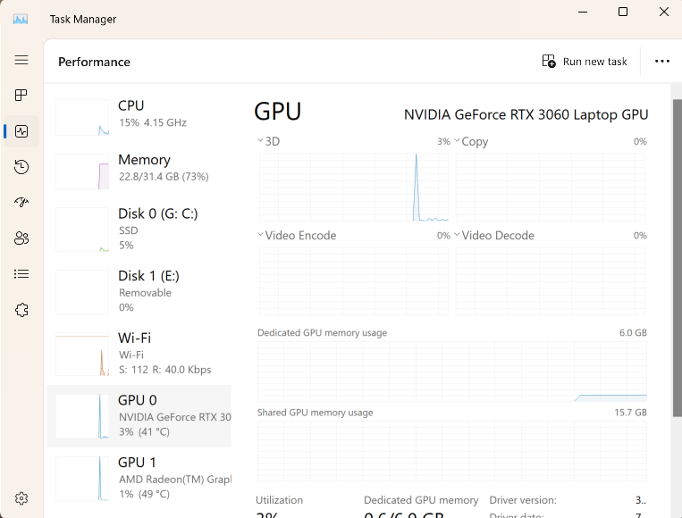
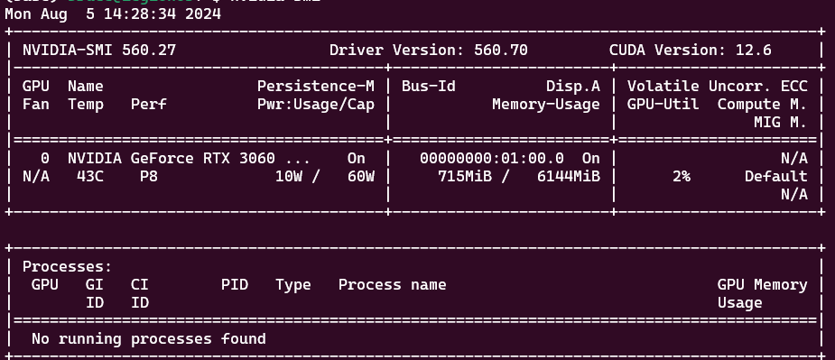
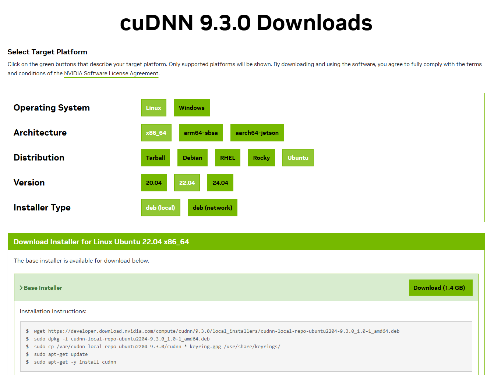

# Install NVIDIA GPU display driver

In this article, learn how to set up your Windows laptop or desktop, using [Windows Subsystem for Linux (WSL)](https://learn.microsoft.com/en-us/windows/wsl/about). You will also set up your graphics card to develop your machine learning application on your NVIDIA GPU.

## Definition

- GPU is an abbreviation for [graphics processing unit](https://support.microsoft.com/en-us/windows/all-about-graphics-processing-units-gpus-e159bedb-80b7-4738-a0c1-76d2a05beab4)
- [CUDA](https://en.wikipedia.org/wiki/CUDA) is a proprietary parallel computing platform and application programming interface (API) for software to use certain types of graphics processing units (GPUs) for accelerated general-purpose processing. CUDA is designed to work with programming languages such as C, C++, Fortran and Python. 

## Prerequisites

You will need:

- Laptop or desktop development computer with an NVIDIA GPU. See how to check the GPU hardware in the following step.
- Ensure you are running Windows 11 or Windows 10, version 21H2 or higher.

## Find out your GPU

Your computer’s GPU, or ,  helps your PC or laptop handle visuals like graphics and videos.

Windows Task Manager, System Information, PowerShell, and DxDiag are built-in tools to check your GPU on Windows.

Start **Task Manager** from your start menu. Click **Performance** tab. You can see the GPUs installed on your computer.



You may have more than one display. 

For gamers: if you have multiple GPUs in your system — for example, as in a laptop with a low-power Intel GPU for use on battery power and a high-power NVIDIA GPU for use while plugged in and gaming — you can control which GPU a game uses from Windows 10's Settings app. These controls are also built into the NVIDIA Control Panel.

You can also check by running PowerShell command:

```powershell
Get-CimInstance win32_VideoController
```

You will need to know the GPU information to select the right driver for your computer.

## Install the GPU Driver

Download and install the NVIDIA CUDA enabled driver for WSL to use with your existing CUDA ML workflows. 


For more info about which driver to install, see:

- [Getting Started with CUDA on WSL 2](https://docs.nvidia.com/cuda/wsl-user-guide/index.html#getting-started-with-cuda-on-wsl)
- [CUDA on Windows Subsystem for Linux (WSL)](https://developer.nvidia.com/cuda/wsl)

## Install or Update WSL 2

Launch your preferred Windows Terminal / Command Prompt / Powershell and install WSL:

```bash
wsl.exe --install
```

Ensure you have the latest WSL kernel:

```bash
wsl.exe --update
```

## Start WSL

From a Windows terminal, enter WSL:

```powershell
C:\> wsl.exe
```

## Test the driver installation

To test the driver installation:

```bash
nvidia-smi -L
```
Returns something similar to:

```text
GPU 0: NVIDIA GeForce RTX 3060 Laptop GPU (UUID: GPU-fbeb177f-f196-93e0-b215-12b7c899dc82)
```

OR for more fun

```bash
nvidia-smi
```

to see:



## Test your Docker container

You will need to have set up Docker. Run this command to start your GPU with NVIDIA NGC TensorFlow container.

```bash
docker run --gpus all -it --shm-size=1g --ulimit memlock=-1 --ulimit stack=67108864 nvcr.io/nvidia/tensorflow:20.03-tf2-py3
```

## Try a pre-trained model
<!--
Then run a pre-trained model that is built into this container.

```bash
cd nvidia-examples/cnn/
python resnet.py --batch_size=64
```

If you get errors, follow the mediation described in [](https://stackoverflow.com/questions/67045622/tensorflow-stream-executor-cuda-cuda-driver-cc328-failed-call-to-cuinit-cuda).

This could take hours or days depending on your computer.
-->

Pull the Tensorflow Docker image:

```bash
docker pull tensorflow/tensorflow:latest-gpu-jupyter
docker run -it --rm -p 8888:8888 docker pull tensorflow/tensorflow:latest-gpu-jupyter
```
Start jupyter somehow.

### Run GPU-enabled image

```
lspci | grep -i nvidia
```

```
docker run --gpus all -it --rm tensorflow/tensorflow:latest-gpu \
   python -c "import tensorflow as tf; print(tf.reduce_sum(tf.random.normal([1000, 1000])))"
```

## Install cuDNN Library

cuDNN (CUDA Deep Neural Network) is a library developed by NVIDIA that provides optimized primitives for deep neural networks. It can significantly speed up the training and inference of deep learning models on GPUs. To use cuDNN with Jupyter Notebook, you need to download and install the cuDNN library from NVIDIA’s website: https://developer.nvidia.com/cudnn.



## Next steps

See:
- [NVIDIA CUDA on WSL User Guide](https://docs.nvidia.com/cuda/wsl-user-guide/index.html#getting-started-with-cuda-on-wsl-2)
- Start using your exisiting Linux workflows through NVIDIA Docker, or by installing [PyTorch](https://pytorch.org/get-started/locally/) or [TensorFlow](https://www.tensorflow.org/install/gpu) inside WSL.
- Set up Jupyter Notebook
- Set up for Docker
- Set up for Podman

## References

See:

- [Getting Started with CUDA on WSL 2](https://docs.nvidia.com/cuda/wsl-user-guide/index.html#getting-started-with-cuda-on-wsl-2)
- [How to Check What Graphics Card (GPU) Is in Your PC](https://www.howtogeek.com/414201/how-to-check-what-graphics-card-gpu-is-in-your-pc/)
- [Enable NVIDIA CUDA on WSL](https://learn.microsoft.com/en-us/windows/ai/directml/gpu-cuda-in-wsl)
- Red Hat documentation: [Installing Podman and the NVIDIA Container Toolkit](https://docs.nvidia.com/ai-enterprise/deployment-guide-rhel-with-kvm/0.1.0/podman.html)
- [Get started with GPU acceleration for ML in WSL](https://learn.microsoft.com/en-us/windows/wsl/tutorials/gpu-compute)

Video:

[CUDA Tutorials I Installing CUDA Toolkit on Windows and WSL](https://www.youtube.com/watch?v=JaHVsZa2jTc&t=2s)