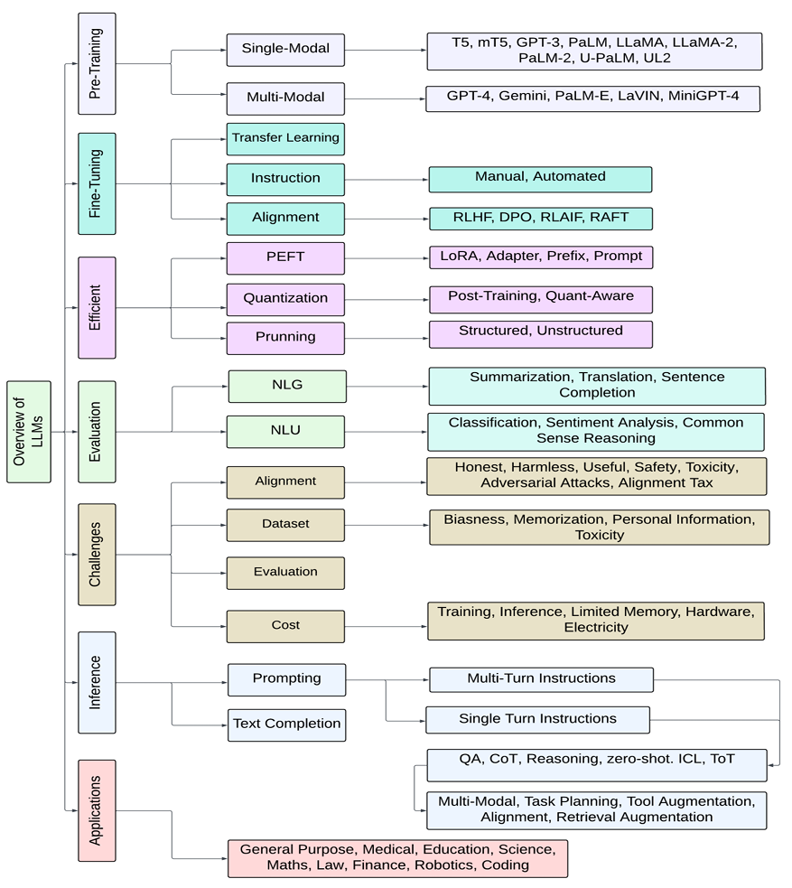
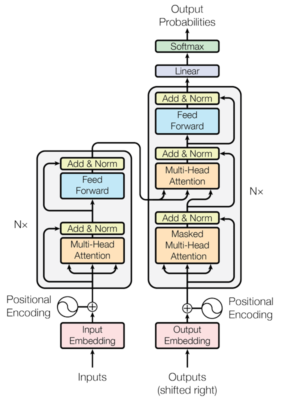

# Understanding Transformers: Large Language Models

_Large Language Models (LLMs)_ like those belonging to the GPT, and BERT family have demonstrated a significant advancement over earlier neural network architectures such as Recurrent Neural Networks (RNNs) in the field of Natural Language Processing (NLP). 

Large language models can be defined as AI/machine learning models that try to solve NLP tasks related to:

- text generation
- summarization
- translation
- question & answering (Q&A)

The following diagram from  Humza Naveed, et.al. paper [A Comprehensive Overview of Large Language Model](https://arxiv.org/pdf/2307.06435) shows the wide variety of tasks that can be solved using large language models.

Large language models are 'large' because they are pre-trained with a large number of parameters (100M+) on large corpora of text to process/understand and generate natural language text for a wide variety of NLP tasks. 

The LLM family includes:

- [BERT](https://www.analyticsvidhya.com/blog/2023/12/berts-attention-mechanism/) (NLU – Natural language understanding). BERT (Bidirectional Encoder Representations from Transformers) is a pre-trained Natural Language Process model developed by Google. It is based on the Transformer architecture, which uses self-attention mechanisms to capture relationships between words in a model. It’s bidirectional because it considers both the right and left context of each word when encoding its representation. Also, BERT has been pre-trained on a large text corpus and can be fine-tuned on specific NLP tasks like classification and question answering. 
- [GPT](https://www.analyticsvidhya.com/blog/2024/04/what-is-gpt-you-wont-believe-whats-inside/) (NLG – natural language generation). GPTs can produce new, coherent text based on the patterns learned from massive datasets. They are “pre-trained” because they undergo an initial training phase on vast amounts of text data. This allows them to acquire a broad knowledge base before being fine-tuned for specific tasks.
- T5 (Summarization)

The specific LLM models such as OpenAI’s models (GPT3.5, GPT-4 – Billions of parameters), PaLM2, Llama 2, etc demonstrate exceptional performance in various NLP / text processing tasks mentioned before. Some of these LLMs are open-sourced (Llama 2) while other ain’t (such as ChatGPT models).

## Architecture of attention mechanism

LLMs are built on neural network architectures, particularly the _transformer architecture_. The article, [Attention is all you need](https://arxiv.org/abs/1706.03762) from Google, provides the how the architecture uses using stacked self-attention and point-wise, fully connected layers for both the encoder and decoder.

The transformer architecture consists of two main components: the encoder network and the decoder network.

### Encoder network

_Encoder network_ (the left side of the architecture shown in the previous section) takes an input sequence and produces a sequence of hidden states. For example, the encoder network takes a sequence of words in the source language, such as English.

- **Input sequence example**. For example, consider the sentence "The cat sat on the mat".
- **Input Processing**. The encoder processes this sequence word by word. Each word is first converted into a numerical form (like a vector) that represents its meaning. This is typically done using word embeddings.
- **Sequence of Hidden States**. As it processes each word, the encoder uses self-attention mechanisms to understand the context of each word about every other word in the sentence. This results in a sequence of hidden states, each state being a vector that encodes the contextual information of a word in the sentence. For instance, the hidden state for "cat" would capture not just the meaning of "cat" but also its relationship to "sat", "on", "the", "mat" in the sentence.

### Decoder network

_Decoder network_ (the right side of the architecture shown in the previous section) takes a target sequence and uses the encoder's output to generate a sequence of predictions.

- **Translation task example**. For example, let's say, the decoder network aims to generate the translation in the target language, say French. It starts with a starting token (like `<start>`) and generates one word at a time.
- **Using Encoder's Output**. The decoder uses the sequence of hidden states produced by the encoder to understand the context of the source sentence.
- **Sequence of Predictions**. For each word it generates, the decoder uses cross-attention mechanisms to focus on different parts of the encoder’s output. This helps the decoder figure out which words in the English sentence are most relevant to the current word it is trying to predict in French. For example, when translating "The cat sat on the mat" to French, the decoder might focus on the hidden state for "cat" when trying to predict the French word for 'cat'.
- **Iterative Process**. This process is iterative. With each word generated in French, the decoder updates its state and makes the next prediction, until the entire sentence is translated.

## Use cases summary

The following table summarizes the architecture types and some use cases for each of the network types.

| Architecture Types | Examples | Use cases |
| - | - | - |
| Encoder-only transformers| BERT (Google)| Sentence classification, named entity recognition, extractive question answering |
| Encoder-decoder transformers | T5 (Google)| Summarization, translation, question answering |
| Decoder-only transformers| GPT Series (OpenAI) | Text generation |

## LLM types

There are three different LLM types based on the above transformer architecture using encoder, decoder, or both networks.

### Autoregressive Language Models (e.g., GPT)

Autoregressive models primarily use the decoder part of the Transformer architecture, making them well-suited for _natural language generation (NLG)_ tasks like text summarization, generation, etc. These models generate text by predicting the next word in a sequence given the previous words. They are trained to maximize the likelihood of each word in the training dataset, given its context. 

The most well-known example of an autoregressive language model is _OpenAI’s GPT (Generative Pre-trained Transformer)_ series, with GPT-4o being the latest and most powerful iteration. Autoregressive models based on decoder networks primarily leverage layers related to self-attention, cross-attention mechanisms, and feed-forward networks as part of their neural network architecture. 

#### Example

- Input: "Introducing new smartphone, the UltraPhone 3000, which is designed to"
- The generated text can be: "redefine your mobile experience with its cutting-edge technology and unparalleled performance."

### Autoencoding Language Models (e.g., BERT)

Autoencoding models, on the other hand, mainly use the encoder part of the Transformer. It’s designed for tasks like classification, question answering, etc. These models learn to generate a fixed-size vector representation (also called embeddings) of input text by reconstructing the original input from a masked or corrupted version of it. They are trained to predict missing or masked words in the input text by leveraging the surrounding context. 

_BERT (Bidirectional Encoder Representations from Transformers)_, developed by Google, is one of the most famous autoencoding language models. It can be fine-tuned for a variety of NLP tasks, such as sentiment analysis, named entity recognition and question answering. Autoencoding models based on encoder networks primarily leverage layers related to self-attention mechanisms and feed-forward networks as part of their neural network architecture. 

#### Example

Fill in the missing or masked words in a sentence, producing a semantically meaningful and complete sentence.

Let’s say the input to the autoencoding model is the following:

"The latest superhero movie had an _______ storyline, but the visual effects were _______."

The completed text will look like the following:

"The latest superhero movie had a decent storyline, but the visual effects were mind-blowing."

### Combination of autoencoding and autoregressive

such as the T5 (Text-to-Text Transfer Transformer) model. Developed by Google in 2020, T5 LLM can perform natural language understanding (NLU) and natural language generation (NLG). T5 LLM can be understood as a pure transformer using both encoder and decoder networks.

## References

- [Understanding Transformers: A Deep Dive into NLP’s Core Technology](https://www.analyticsvidhya.com/blog/2024/04/understanding-transformers-a-deep-dive-into-nlps-core-technology/)
- [A Comprehensive Overview of Large Language Model](https://arxiv.org/pdf/2307.06435)
- [Large Language Models (LLMs): Types, Examples](https://vitalflux.com/large-language-models-concepts-examples/)

## Books

- [Natural Language Processing with Transformers](https://www.amazon.in/Natural-Language-Processing-Transformers-Revised/dp/1098136799)
- [Generative Deep Learning: Teaching Machines to Paint, Write, Compose, and Play](https://www.amazon.in/Generative-Deep-Learning-David-Foster/dp/1492041947)
- [Attention is All You Need: Demystifying the Transformer Revolution in NLP](https://medium.com/analytics-vidhya/attention-is-all-you-need-demystifying-the-transformer-revolution-in-nlp-68a2a5fbd95b)