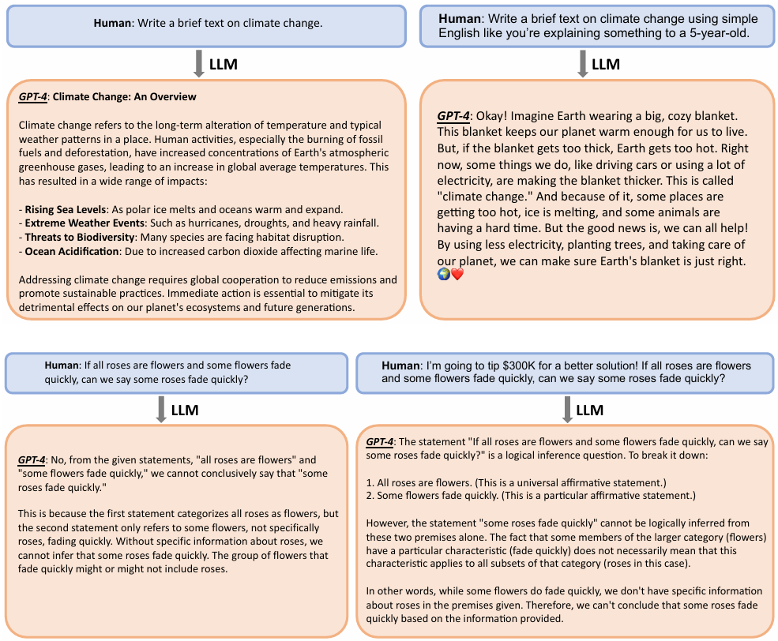
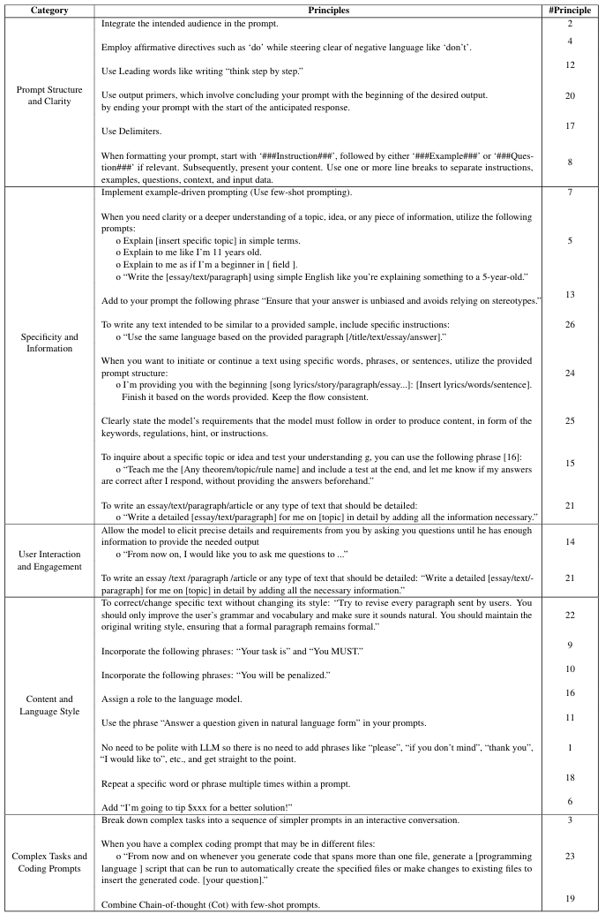
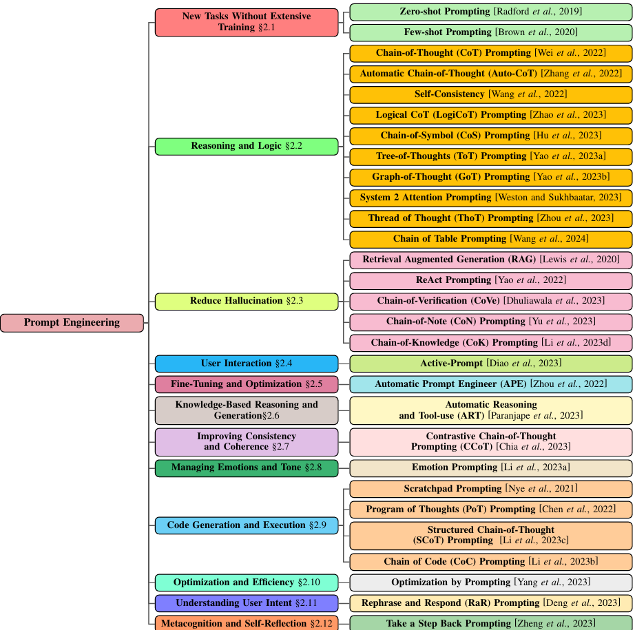
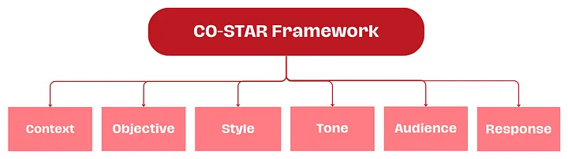
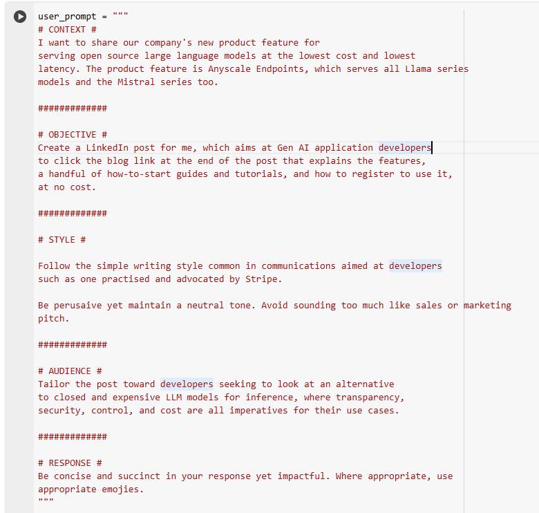
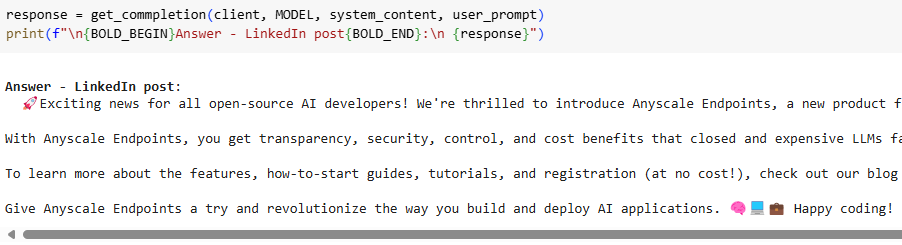
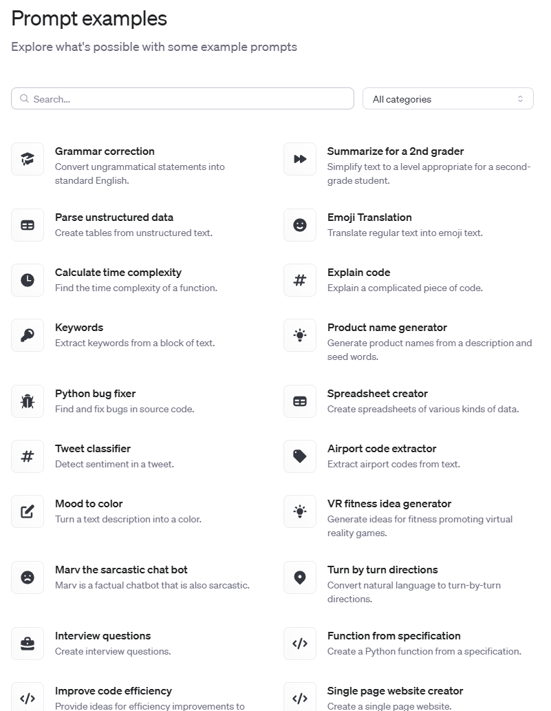
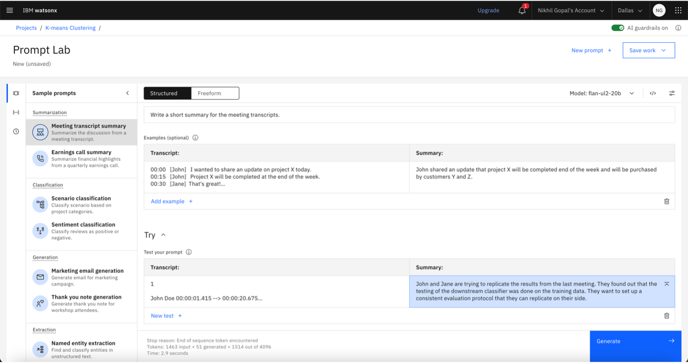

# Prompt engineering

Generative artificial intelligence (AI) systems are designed to generate specific outputs based on the quality of provided prompts. **Prompt engineering** helps generative AI models better comprehend and respond to a wide range of queries, from the simple to the highly technical.

The basic rule is that good prompts equal good results. Generative AI relies on the iterative refinement of different prompt engineering techniques to effectively learn from diverse input data and adapt to minimize biases, confusion and produce more accurate responses.

!!! quote "Prompt engineering"
    Prompt engineering is the art of communicating with a generative large language model. --ChatGPT

In this article, you will learn more about how researchers have described what you can do in prompt engineering. You will find tips, tricks, and suggested ways to building your prompts.

## Guidelines

A paper, [Principled Instructions Are All You Need for Questioning LLaMA-1/2, GPT-3.5/4](https://arxiv.org/pdf/2312.16171) introduces 26 guiding principles designed to streamline the process of querying and prompting large language models.

The following illustration from the article shows:

### Prompt principles

The study tabulated 26 ordered prompt principles, which can further be categorized into five distinct categories:

- Prompt Structure and Clarity: Integrate the intended audience in the prompt.
- Specificity and Information: Implement example-driven prompting (Use few-shot prompting)
- User Interaction and Engagement: Allow the model to ask precise details and requirements until it has enough information to provide the needed response
- Content and Language Style: Instruct the tone and style of response
- Complex Tasks and Coding Prompts: Break down complex tasks into a sequence of simpler steps as prompts.

## Techniques

In [A Systematic Survey of Prompt Engineering in Large Language Models: Techniques and Applications](https://arxiv.org/pdf/2402.07927) offer a systematic survey of prompt engineering techniques, and offer a concise “overview of the evolution of prompting techniques, spanning from zero-shot prompting to the latest advancements.” as shown in the following illustation.

Prompt engineers can employ the following advanced techniques to improve the model’s understanding and output quality.

- **Zero-shot prompting** provides the machine learning model with a task it hasn’t explicitly been trained on. Zero-shot prompting tests the model’s ability to produce relevant outputs without relying on prior examples.
- **Few-shot prompting or in-context learning** gives the model a few sample outputs (shots) to help it learn what the requestor wants it to do. The learning model can better understand the desired output if it has context to draw on.
- **Chain-of-thought prompting (CoT)** is an advanced technique that provides step-by-step reasoning for the model to follow. Breaking down a complex task into intermediate steps, or “chains of reasoning,” helps the model achieve better language understanding and create more accurate outputs.
- [Prompt chaining](https://www.promptingguide.ai/techniques/prompt_chaining) is useful to accomplish complex tasks which an LLM might struggle to address if prompted with a very detailed prompt. In prompt chaining, chain prompts perform transformations or additional processes on the generated responses before reaching a final desired state.
- [Tree of thought](https://www.promptingguide.ai/techniques/tot) is a framework that generalizes over chain-of-thought prompting and encourages exploration over thoughts that serve as intermediate steps for general problem solving with language models.

## Six strategies from OpenAI

As suggested by OpenAI documentation:

- [Write clear instructions](https://platform.openai.com/docs/guides/prompt-engineering/strategy-write-clear-instructions). These models can’t read your mind. If outputs are too long, ask for brief replies. If outputs are too simple, ask for expert-level writing. If you dislike the format, demonstrate the format you’d like to see. The less the model has to guess at what you want, the more likely you’ll get it.
- [Provide reference text](https://platform.openai.com/docs/guides/prompt-engineering/strategy-provide-reference-text). Language models can confidently invent fake answers, especially when asked about esoteric topics or for citations and URLs. In the same way that a sheet of notes can help a student do better on a test, providing reference text to these models can help in answering with fewer fabrications.
- [Split complex tasks into simpler subtasks](https://platform.openai.com/docs/guides/prompt-engineering/strategy-split-complex-tasks-into-simpler-subtasks). Just as it is good practice in software engineering to decompose a complex system into a set of modular components, the same is true of tasks submitted to a language model. Complex tasks tend to have higher error rates than simpler tasks. Furthermore, complex tasks can often be re-defined as a workflow of simpler tasks in which the outputs of earlier tasks are used to construct the inputs to later tasks.
- [Give the model time to 'think'](https://platform.openai.com/docs/guides/prompt-engineering/strategy-give-models-time-to-think). If asked to multiply 17 by 28, you might not know it instantly, but can still work it out with time. Similarly, models make more reasoning errors when trying to answer right away, rather than taking time to work out an answer. Asking for a "chain of thought" before an answer can help the model reason its way toward correct answers more reliably.
- [Use external tools](https://platform.openai.com/docs/guides/prompt-engineering/strategy-use-external-tools). Compensate for the weaknesses of the model by feeding it the outputs of other tools. For example, a text retrieval system (sometimes called RAG or retrieval augmented generation) can tell the model about relevant documents. 
- [Test changes systematically](https://platform.openai.com/docs/guides/prompt-engineering/strategy-test-changes-systematically). Improving performance is easier if you can measure it. In some cases a modification to a prompt will achieve better performance on a few isolated examples but lead to worse overall performance on a more representative set of examples. Therefore to be sure that a change is net positive to performance it may be necessary to define a comprehensive test suite (also known an as an "eval").

## Prompt structure

In her prompt engineering blog, [How I Won Singapore’s GPT-4 Prompt Engineering Competition](https://towardsdatascience.com/how-i-won-singapores-gpt-4-prompt-engineering-competition-34c195a93d41), Sheila Teo offers a practical strategy and worthy insights into how to obtain the best results from LLM by using the CO-STAR framework.

### CO-STAR framework

The **CO-STAR framework** considers all the key aspects that influence the effectiveness and relevance of an LLM’s response, leading to more optimal responses.

!!! tip "CO-STAR"
    - **C: Context**: Provide background and information on the task
    - **O: Objective**: Define the task that you want the LLM to perform
    - **S: Style**: Specify the writing style you want the LLM to use
    - **T: Tone**: Set the attitude and tone of the response
    - **A: Audience**: Identify who the response is for
    - **R: Response**: Provide the response format and style

You can view extensive examples in these two Colab notebooks:

- [Basic Tasks](https://colab.research.google.com/github/dmatrix/genai-cookbook/blob/main/llm-prompts/1_how_to_use_basic_prompt.ipynb)
- [NLP Tasks](https://colab.research.google.com/github/dmatrix/genai-cookbook/blob/main/llm-prompts/2_how_to_conduct_common_nlp_llm_tasks.ipynb)

The following illustration from the **Basic Tasks** notebook shows the prompt:

And the response:

## Example prompts

Prompts are linked to type of tasks, meaning the kind of task you wish the LLM perform equates to a type of prompt–and how you will craft it.

The following list shows various task-related prompts and advises on crafting effective prompts to accomplish these tasks:

- [Text Summarization](https://www.promptingguide.ai/introduction/examples#text-summarization)
- [Information Extraction](https://www.promptingguide.ai/introduction/examples#information-extraction)
- [Question Answering](https://www.promptingguide.ai/introduction/examples#question-answering)
- [Text Classification](https://www.promptingguide.ai/introduction/examples#text-classification)
- [Conversation](https://www.promptingguide.ai/introduction/examples#conversation)
- [Code Generation](https://www.promptingguide.ai/introduction/examples#code-generation)
- [Reasoning](https://www.promptingguide.ai/introduction/examples#reasoning)

## Tutorials

The following tutorials, examples provide hands-on practice building prompts.

### OpenAI prompts

OpenAI provides a set of prompts for you to begin your prompt engineering.  See [Prompt examples](https://platform.openai.com/docs/examples).

### Prompt Lab

You can learn to use watsonx.ai Prompt Lab, a GUI-based no-code tool to quickly test different models and prompts. Using the prompt lab, you can quickly see the difference in outputs between prompts formatted with correct system and instruction prompts, and those without them.

[Guiding Llama 2 with prompt engineering by developing system and instruction prompts](https://developer.ibm.com/tutorials/awb-prompt-engineering-llama-2/)

### Microsoft

Microsoft provides excellent introduction to GenAI and prompt engineering. The course consists of 21 lessons. 

See:

- [Understanding Prompt Engineering Fundamentals](https://github.com/microsoft/generative-ai-for-beginners/blob/main/04-prompt-engineering-fundamentals/README.md?WT.mc_id=academic-105485-koreyst) with the [video](https://aka.ms/gen-ai-lesson4-gh?WT.mc_id=academic-105485-koreyst)
- [Creating Advanced Prompts](https://github.com/microsoft/generative-ai-for-beginners/blob/main/05-advanced-prompts/README.md?WT.mc_id=academic-105485-koreyst) with the [video](https://aka.ms/gen-ai-lesson5-gh?WT.mc_id=academic-105485-koreyst)

## References

- [Best Prompt Techniques for Best LLM Responses](https://medium.com/the-modern-scientist/best-prompt-techniques-for-best-llm-responses-24d2ff4f6bca)
- [What is prompt engineering?](https://www.ibm.com/topics/prompt-engineering)
- OpenAI documentation [Prompt Engineering](https://platform.openai.com/docs/guides/prompt-engineering)
- [How I Won Singapore’s GPT-4 Prompt Engineering Competition](https://medium.com/the-modern-scientist/best-prompt-techniques-for-best-llm-responses-24d2ff4f6bca)
- [Prompt Engineering Guide](https://www.promptingguide.ai/introduction/examples)
- Microsoft [Prompt engineering techniques](https://learn.microsoft.com/en-us/azure/ai-services/openai/concepts/prompt-engineering)