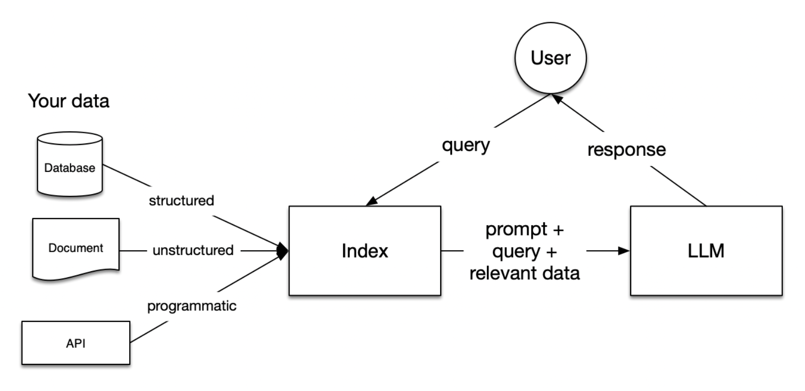

# Implementing RAG

**RAG (Retrieval-Augmented Generation)** expands the knowledge of large language models (LLMs) from their initial training data to external datasets you provide. 

You provide the data. RAGs give your users immediate access to accurate, real-time, and relevant answers. So when one of your employees or customers asks your LLM a question, they get answers trained on your secure business data.

## Business value

Once you build a RAG using a pipeline:

- **LLMs can answer complex questions**: RAG allows LLMs to tap into external knowledge bases and specific bodies of information to answer challenging questions with precision and detail.
- **LLMs that generate up-to-date content**: By grounding outputs in real-world data, RAG-powered LLMs can create more factual and accurate documents, reports, and other content.
- **Increase LLM response accuracy**: RAG augments answer generation with real-time data that’s relevant to your industry, customers, and business – so your chatbot is less likely to hallucinate to fill in missing information. 

## How it works

RAG works in three stages:

1. **Retrieval**: Someone queries the LLM and the system looks for relevant information that informs the final response. 

    It searches through an external dataset or document collection to find relevant pieces of information. This dataset could be a curated knowledge base, a set of web pages, or any extensive collection of text, images, videos, and audio.

2. **Augmentation**: The input query is enhanced with the information retrieved in the previous step.

    The relevant information found during the retrieval step is combined with the original query. This augmented input is then prepared for the next stage, ensuring that it is in a format suitable for the generation model.

3. **Generation**: The final augmented response or output is generated. Your LLM uses the additional context provided by the augmented input to produce an answer that is not only relevant to the original query but enriched with information from external sources.

The following diagram from the OpenAI Cookbook provides an overview:

So far so good. So how do you managed this whole process? You use a _pipeline_.

## Turns out, RAG Pipelines can be complex

In general, the RAG Pipelines break into five steps:

1. **Loading**: This involves importing your data into the RAG pipeline – e.g. text files, PDFs, websites, databases, APIs, etc. LlamaHub offers an extensive array of connectors for this purpose.
2. **Indexing**: At this stage, you're developing a data structure conducive to data querying. For Large Language Models (LLMs), this typically involves generating _vector embeddings_, which are numerical representations of your data's meaning.
3. **Storing**: After indexing your data, the next step is to store the index along with any additional metadata. This is crucial to eliminate the necessity for re-indexing in the future.
4. **Querying**: Depending on your chosen indexing strategy, there are numerous methods to utilize LLMs and LlamaIndex data structures for querying. These methods range from sub-queries and multi-step queries to hybrid approaches.
5. **Evaluation**: An indispensable part of any RAG pipeline is to assess its effectiveness. This could be in comparison to other strategies or following any modifications. Evaluation offers objective metrics to gauge the accuracy, reliability, and speed of your responses to queries.

For more information, see [RAG Pipeline explained](./rag-pipeline.md)

### Deep dive into RAG

For a deep dive into the complexity, see [Retrieval-Augmented Generation for Knowledge-Intensive NLP Tasks](https://arxiv.org/abs/2005.11401).

## Select technologies

The technologies bleed across the steps in the pipeline. And the solutions vary drive a particular LLM soltuion. 

### Decoding vs Encoding vs both

In [LLM models](./largelanguage.md) article in this site, you can see a table summarizes the architecture types and some use cases for each of the network types.

| Architecture Types | Examples | Use cases |
| - | - | - |
| Encoder-only transformers| BERT (Google)| Sentence classification, named entity recognition, extractive question answering |
| Encoder-decoder transformers | T5 (Google)| Summarization, translation, question answering |
| Decoder-only transformers| GPT Series (OpenAI) | Text generation |

### LangChain vs LlamaIndex

Another big choice is with Langchain and LlamaIndex. Datacamp article [LangChain vs LlamaIndex: A Detailed Comparison](https://www.datacamp.com/blog/langchain-vs-llamaindex) provides a good overview of which works best based on your use case. They write:

| Feature | Langchain | LlamaIndex |
| - | - | - |
| Data indexing | LangChain provides a modular and customizable approach to data indexing with complex chains of operations, integrating multiple tools and LLM calls. | LlamaIndex transforms various types of data, such as unstructured text documents and structured database records, into numerical embeddings that capture their semantic meaning. |
| Retrieval algorithms | LangChain integrates retrieval algorithms with LLMs to produce context-aware outputs. LangChain can dynamically retrieve and process relevant information based on the context of the user’s input, which is useful for interactive applications like chatbots.  | LlamaIndex is optimized for retrieval, using algorithms to rank documents based on their semantic similarity to perform a query. |
| Customization | LangChain, however, provides extensive customization options. It supports the creation of complex workflows for highly tailored applications with specific requirements. | LlamaIndex offers limited customization focused on indexing and retrieval tasks. Its design is optimized for these specific functions, providing high accuracy. |
| Context retention | LangChain excels in context retention, which is crucial for applications where retaining information from previous interactions and coherent and contextually relevant responses over long conversations are crucial. | LlamaIndex provides basic context retention capabilities suitable for simple search and retrieval tasks. It can manage the context of queries to some extent but is not designed to maintain long interactions. |
| Use cases | LangChain is better suited for applications requiring complex interaction and content generation, such as customer support, code documentation, and various NLP tasks. | LlamaIndex is ideal for internal search systems, knowledge management, and enterprise solutions where accurate information retrieval is critical. |
| Performance | LangChain is efficient in handling complex data structures that can operate inside its modular architecture for sophisticated workflows. | LlamaIndex is optimized for speed and accuracy; the fast retrieval of relevant information. Optimization is crucial for handling large volumes of data and quick responses. |
| Lifecycle management | LangChain offers evaluation suite, LangSmith, tools for testing, debugging, and optimizing LLM applications, ensuring that applications perform well under real-world conditions. | LlamaIndex integrates with debugging and monitoring tools to facilitate lifecycle management. Integration helps tracking the performance and reliability of applications by providing insights and tools for troubleshooting. |

### Developer, data science, and machine learning tooling

- [Hugging Face RAG Transformer](https://huggingface.co/blog/ray-rag): Provides a comprehensive collection of pre-trained models, including RAG.
- [Vellum.ai](https://www.vellum.ai/): Vellum is a development platform for building LLM apps with tools for prompt engineering, semantic search, version control, testing, and monitoring.
- [Elasticsearch](https://cookbook.openai.com/examples/vector_databases/elasticsearch/elasticsearch-retrieval-augmented-generation): A A powerful search engine, ideal for the retrieval phase in RAG.
- [FAISS (Facebook AI Similarity Search)](https://engineering.fb.com/2017/03/29/data-infrastructure/faiss-a-library-for-efficient-similarity-search/): Efficient for similarity search in large datasets, useful for retrieval.
- [Dense Passage Retrieval (DPR)](https://huggingface.co/docs/transformers/model_doc/dpr): Optimized for retrieving relevant passages from extensive text corpora.
- [Haystack](https://haystack.deepset.ai/tutorials/07_rag_generator): An NLP framework that simplifies the building of search systems, integrating well with Elasticsearch and DPR.
- [PyTorch](https://huggingface.co/docs/transformers/model_doc/rag) and [TensorFlow](https://huggingface.co/docs/transformers/model_doc/rag): Foundational deep learning frameworks for developing and training RAG models.
- [ColBERT](https://medium.com/@zz1409/colbert-a-late-interaction-model-for-semantic-search-da00f052d30e): A BERT-based ranking model for high-precision retrieval.
- [Apache Solr](https://solr.apache.org/): An open-source search platform, an alternative to Elasticsearch for retrieval.
- [Pinecone](https://www.pinecone.io/learn/fast-retrieval-augmented-generation/): A scalable vector database optimized for machine learning applications.Ideal for vector-based similarity search, playing a crucial role in the retrieval phase of RAG.
- [Langchain](https://www.langchain.com/): A toolkit designed to integrate language models with external knowledge sources. Bridges the gap between language models and external data, useful for both the retrieval and augmentation stages in RAG.
- [LlamaIndex](https://www.llamaindex.ai/): Specializes in indexing and retrieving information, aiding the retrieval stage of RAG. Facilitates efficient indexing, making it suitable for applications requiring rapid and relevant data retrieval.

## References

- [RAG 101: What is RAG and why does it matter?](https://codingscape.com/blog/rag-101-what-is-rag-and-why-does-it-matter)
- [Understanding RAG Part I: Why It’s Needed](https://machinelearningmastery.com/understanding-rag-part-i-why-its-needed/)
- [Understanding RAG Part II: How Classic RAG Works](https://machinelearningmastery.com/understanding-rag-part-ii-how-classic-rag-works/)
- [Understanding RAG III: Fusion Retrieval and Reranking](https://machinelearningmastery.com/understanding-rag-iii-fusion-retrieval-and-reranking/)
- [LangChain vs LlamaIndex: A Detailed Comparison](https://www.datacamp.com/blog/langchain-vs-llamaindex)