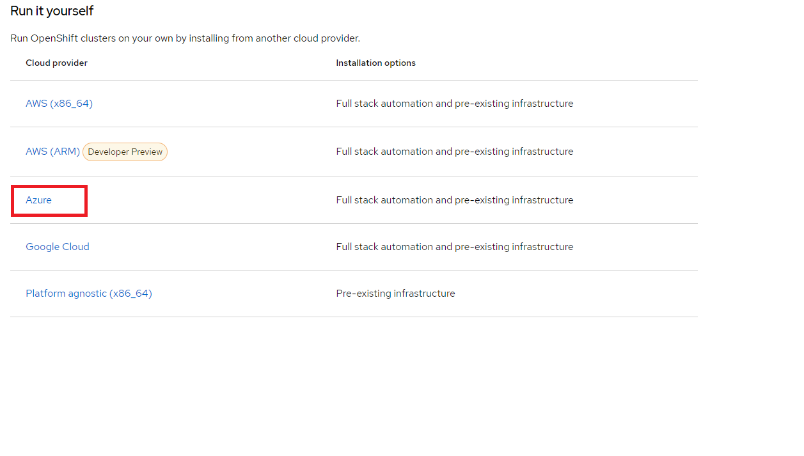
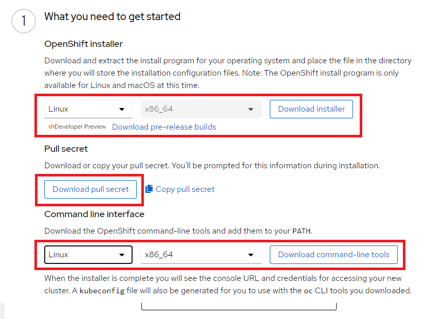

# Dev install OpenShift 4.8 on Azure with customizations

In this document learn to install OpenShift on Azure.

In particular, this will document the config file needed by the installer for a custom install that meets the following requirements:

## Architectural decisions for this installation

- Installer provisioned infrastructure
- OpenShift administrator-level credential secret in the kube-system namespace. (As an alternative, you can put [Cloud Credential Operator (CCO)](https://docs.openshift.com/container-platform/4.8/installing/installing_azure/manually-creating-iam-azure.html#manually-creating-iam-azure) into manual mode)

## Prerequisites

You will need:

- Azure environment set up according to the OpsInstallOpenShiftOnAzure documentation. In particular, review details about account configuration, account limits, public DNS zone configuration, required roles, creating service principals, and supported Azure regions.
- [Firewall configured](https://docs.openshift.com/container-platform/4.8/installing/install_config/configuring-firewall.html#configuring-firewall) to allow access to sites.
- Azure CLI. May already be installed on Bastion. See [How to install the Azure CLI](https://docs.microsoft.com/en-us/cli/azure/install-azure-cli) for your operating system.
- Access to [OpenShift Container Platform](https://docs.openshift.com/container-platform/4.8/installing/installing_azure/installing-azure-customizations.html#cluster-entitlements_installing-azure-customizations). 
- `ssh-keygen` installed.
- Linux Bastion with 500 MB of local disk space and `ssh`, `tar`.
- A Red Hat account.

Log on using `az login`. Then use `az account show` to see the subscription id, the tenant id, such as:

```json
[
  {
    "cloudName": "AzureCloud",
    "homeTenantId": "4e7730a0-17bb-4dfa-8dad-7c54d3e761b7",
    "id": "f9700497-11d3-4005-8b1d-3bf45a667424",
    "isDefault": true,
    "managedByTenants": [],
    "name": "Microsoft Azure Sponsorship",
    "state": "Enabled",
    "tenantId": "4e7730a0-17bb-4dfa-8dad-7c54d3e761b7",
    "user": {
      "name": "Bruce.Kyle@ibm.com",
      "type": "user"
    }
  }
]
```

> NOTE: if you have multiple subscriptions, use `az account set --subscription mysubscription` where  `mysubscription` is the GUID or the name of the account you want to make default.

You will need the `id` is the **subscriptiond id** and `tenantId` is the **tenant id** you will need later.

You should also have several items from the service principal from the administrator.

- baseDomain: such as `ibmtechgarage.com`
- appId: it will be a GUID 
- password: it will be the password, probably a GUID generated when the service principal was created

> IMPORTANT: The `appId` and the `password` are sensitive and should not be checked into code. 

## Generate a key pair for cluster node SSH access

You must provide the SSH public key during the installation process.

```
mkdir ~/.azkeys
cd ~/.azkeys
ssh-keygen -t rsa -b 2048 -N '' -f ./azkeys
```

> NOTE: Generating `rsa` key so that OpenShift Container Platform cluster can use FIPS Validated / Modules in Process cryptographic libraries on the x86_64 architecture.

View the public key.

```bash
cat ~/.azkeys/azkeys.pub
```

Add the SSH private key identity to the SSH agent for your local user.

```bash
eval "$(ssh-agent -s)"
# responds with something like Agent pid 814
```

Add SSH private key to the `ssh-agent`.

```bash
ssh-add ~/.azkeys/azkeys
# responds with something like Identity added: /home/bruce/.azkeys/azkeys (bruce@LAPTOP-SLIV8CB4)
```

## Get the installation program

Create a location to download your files, such as.

```sh
mkdir ~/openshiftinstallerfiles 
```

To download the installation file:

1. Download the [Infrastructure Provider](https://console.redhat.com/openshift/install) page on the OpenShift Cluster Manager site.

IMPORTANT: Do not select the top Azure managed services. This is ARO that is a managed service running on Azure. We are selecting intaller-provisioned infrastructure to give us the most flexibility in version, license, sizing, networking.

Select:



Click **Installer-provisioned infrastrcture** box.

Download the installation program for your operating system, and place the file in the directory where you will store the installation configuration files.



2. Copy the file to a known location

Move the file to your ` ~/openshiftinstallerfiles` directory, such as `mv /mnt/c/Users/6J1943897/Downloads/openshift-install-linux.tar.gz ~/openshiftinstallerfiles`

Extract the installation program. 

```bash
cd ~/openshiftinstallerfiles
tar xvf openshift-install-linux.tar.gz

# check to see the files using ls. you should see README.md and openshift-install
```

3. Download your installation pull secret from the Red Hat OpenShift Cluster Manager. 

Return to the OpenShift Cluster Manager page. Click **Download pull secret** button.

## Create the config file

Create a folder for your config file.

```sh
mkdir ~/azureconfig
cd ~/openshiftinstallerfiles
```

Create the config file.

```sh
./openshift-install create install-config --dir ~/azureconfig
```

At the prompts, use the arrow keys to select `azure` then type enter.

## Customize the installation config file

You can customize the 

When the installer is complete you will see the console URL and credentials for accessing your new cluster. A kubeconfig file will also be generated for you to use with the oc CLI tools you downloaded.

## Configure StorageClass for RWX

TFor use with Cloud Paks and customer applications, you will want to dynamically provision [ReadWriteMany (RWX) storage](https://kubernetes.io/docs/concepts/storage/persistent-volumes/), which provides that your storage volume can be mounted as read-write by many nodes. 

You can use either *OpenShift Container Platform storage (OCS)* or *OpenShift Data Foundation (ODF)* Operators or set Azure Files StorageClass. 

OpenShift Container Storage (OCS) has been updated to OpenShift Data Foundation (ODF) starting with version OCP 4.9. For more information, see either:

- [OpenShift Container Platform storage overview](https://docs.openshift.com/container-platform/4.9/storage/index.html) 
- [Deploying OpenShift Data Foundation on Azure Red Hat OpenShift](https://access.redhat.com/documentation/en-us/red_hat_openshift_data_foundation/4.10/html/deploying_openshift_data_foundation_using_microsoft_azure_and_azure_red_hat_openshift/deploying-openshift-container-storage-on-azure-red-hat-openshift_aro).

OR if you prefer, you can set up Azure Files as your StorageClass. See [Create an Azure Files StorageClass on Azure Red Hat OpenShift 4](https://docs.microsoft.com/en-us/azure/openshift/howto-create-a-storageclass).

## Reference

- [Installing a cluster on Azure with customizations](https://docs.openshift.com/container-platform/4.8/installing/installing_azure/installing-azure-customizations.html#installing-azure-customizations)
- [](https://pages.github.ibm.com/up-and-running/watson-aiops/)
- [Install Instana](https://ibmdocs-test.mybluemix.net/docs/en/cloud-paks/cloud-pak-watson-aiops/3.3.0?topic=connections-instana)
- [Install Slack](https://pages.github.ibm.com/up-and-running/watson-aiops/3.2%20PoC%20Cookbooks/AI-Manager-Configuration/)

## Contributors

March 22, 2022