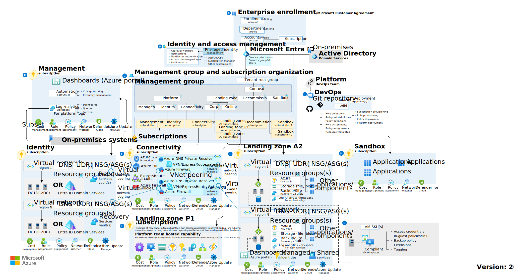
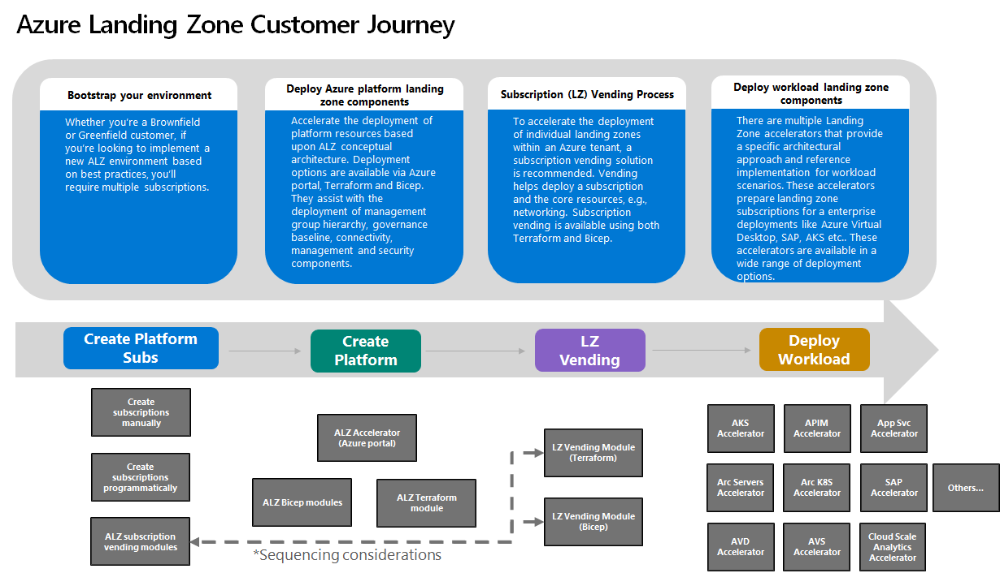

# Azure Landing Zone

An [Azure landing zone architecture](https://learn.microsoft.com/en-us/azure/cloud-adoption-framework/ready/landing-zone/) is scalable and modular to meet various deployment needs. The repeatable infrastructure allows you to apply configurations and controls to every subscription consistently. Modules make it easy to deploy and modify specific Azure landing zone architecture components as your requirements evolve.

The Azure landing zone conceptual architecture shown in the following diagram represents an opinionated target architecture for your Azure landing zone. You should use this conceptual architecture as a starting point and tailor the architecture to meet your needs.

## Landing zone

A landing zone helps you plan for and design an Azure deployment, by conceptualizing a designated area for placement and integration of resources. There are two types of landing zones:

 - **platform landing zone**: provides centralized enterprise-scale foundational services for workloads and applications.
- **application landing zone**: provides services specific to an application or workload.

Concretely, a landing zone can be viewed through two lenses:

- **reference architecture**: a specific design that illustrates resource deployment to one or more Azure subscriptions, which meet the requirements of the landing zone.
- **reference implementation**: artifacts that deploy Azure resources into the landing zone subscription(s), according to the reference architecture. Many landing zones offer multiple deployment options, but the most common is a ready-made Infrastructure as Code (IaC) template referred to as a landing zone accelerator. Accelerators automate and accelerate the deployment of a reference implementation, using IaC technology such as ARM, Bicep, Terraform, and others.

## Landing zone journey

## Reference

- [Prepare for cloud adoption](https://learn.microsoft.com/en-us/azure/cloud-adoption-framework/ready/)
- [What is an Azure landing zone?](https://learn.microsoft.com/en-us/azure/cloud-adoption-framework/ready/landing-zone/)