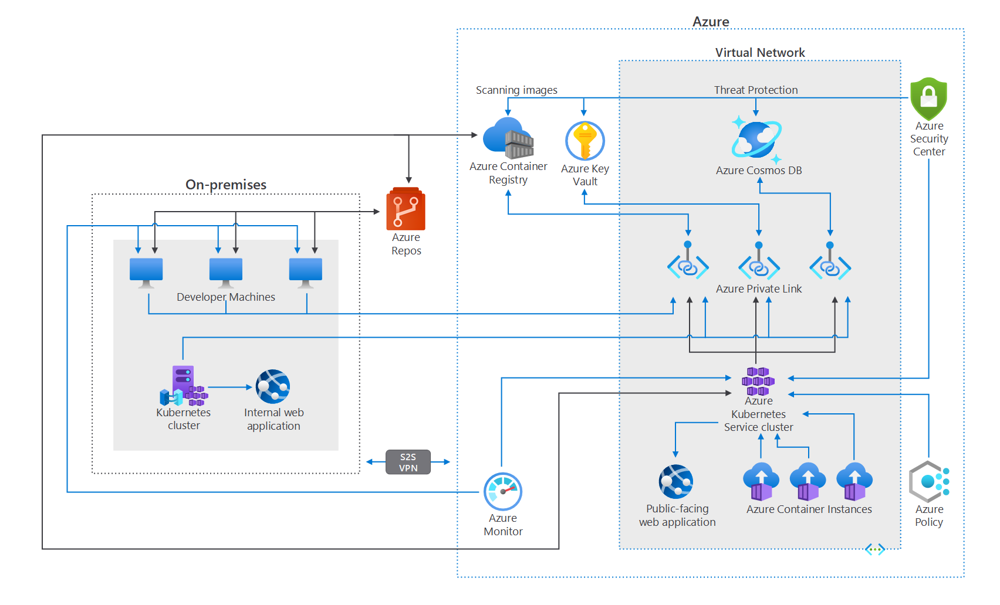

# Sample Azure Resource Manager (ARM) best practice templates

The ARM templates provided as defaults through the Azure portal for various resources are not particularly extensible. And in some few cases, the defaults may not pass security checks and comply with basic policies.

The following links take you to my GitHub site for:

- ARM templates

    - Deployment template
    - Parameter template

- PowerShell script to test the ARM template deployment

    - Including `.EXAMPLE` code that you can copy and paste in PowerShell to test the template deployment

- Azure DevOps pipeline script to deploy a site

## Features

ARM Templates

- Extensible
- Incorporate best practices, such as Role Based Access Control, Private Endpoints, Hub-Spoke network architecture, managed identities, security permissions
- Both template and parameters

PowerShell

- Test individual templates and combination of templates

Azure DevOps Pipeline

- End to end DevOps Pipeline that ties it all together

## Supported Kubernetes architecture

The following diagram illustrates a hybrid deployment where Kubernetes is a central deployment for many services. 

## Sample templates and scripts

From this GitHub:

- [Naming convention](https://github.com/brucedkyle/xolv-site/tree/main/azure-app/namingconvention)
- Create [Resource Group](https://github.com/brucedkyle/xolv-site/tree/main/azure-app/resourcegroup) with locks and access control
- [Azure Storage account](https://github.com/brucedkyle/xolv-site/tree/main/azure-app/storageaccount)
- [Azure Kubernetes Service (AKS) using CNI](https://github.com/brucedkyle/xolv-site/blob/main/azure-app/aks.cni) and [Azure Container Registry (ACR)](https://github.com/brucedkyle/xolv-site/tree/main/azure-app/containerregistry)
- [Azure Functions](https://github.com/brucedkyle/xolv-site/tree/main/azure-app/functions)
- [CosmosDB](https://github.com/brucedkyle/xolv-site/tree/main/azure-app/cosmosdb)
- [Key Vault](https://github.com/brucedkyle/xolv-site/tree/main/azure-app/keyvault), [Key Vault for Cosmos](https://github.com/brucedkyle/xolv-site/tree/main/azure-app/keyvault.cosmos), [Key Vault Permissions](https://github.com/brucedkyle/xolv-site/tree/main/azure-app/keyvault.permissions), [Key Vault Secret](https://github.com/brucedkyle/xolv-site/tree/main/azure-app/keyvault.secret), [Key Vault for Storage](https://github.com/brucedkyle/xolv-site/tree/main/azure-app/keyvault.storage)
- ARM template to [Retrieve Object ID](https://github.com/brucedkyle/xolv-site/tree/main/azure-app/objectid)
- [Role Assignment](https://github.com/brucedkyle/xolv-site/tree/main/azure-app/roleassignment) 
- [SignalR](https://github.com/brucedkyle/xolv-site/tree/main/azure-app/signalr)
- [Virtual Network](https://github.com/brucedkyle/xolv-site/tree/main/azure-app/virtualnetwork)
- [Public IP](https://github.com/brucedkyle/xolv-site/tree/main/azure-app/pip)
- [Redis](https://github.com/brucedkyle/xolv-site/tree/main/azure-app/redis)