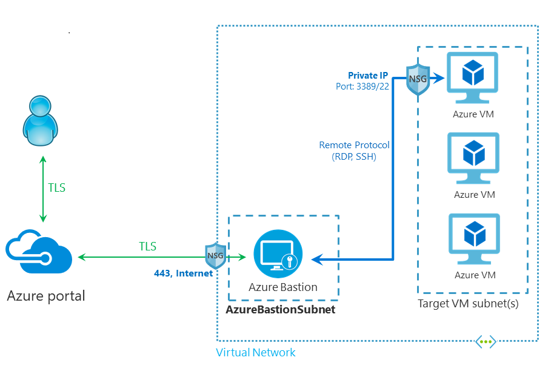
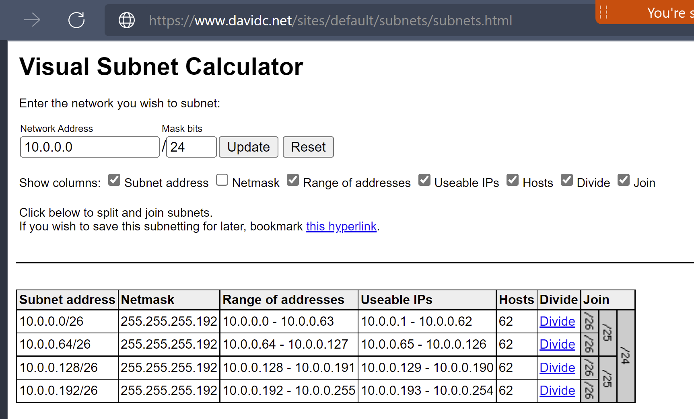

# Set up Azure Bastion installation environment

In this section, set up the Bastion to the create and connect to the OpenShift clusters. You will:

1. Set up a resource group
2. Create a virtual network for the Bastion and the Virtual Machine you will use with the Bastion
3. Create a virtual machine
4. Create the Bastion 
5. Connect the Bastion to the Virtual Machine
6. Use the Virtual Machine

The following diagram shows the architecture of the Bastion you will set up:



## Prerequisites

You will need:

- Azure subscription
- Contributor access to create resource group, virtual networks, Bastion
- Azure CLI installed on your development computer, log in using `az login` and set your subscription using `az account set --subscription <subscriptionid>`

A virtual network design:

- Base virtual network for Bastion: 10.0.0.0/24
- Bastion subnet: 10.0.0.64/26
- Bastion VM subnet: 10.0.0.128/26

- Control plane subnet: 10.0.0.0/26
- Worker subnet: 10.0.0.64/26

OR

- Base virtual network for Bastion: 10.0.0.0/24
- Bastion subnet: 10.0.0.64/26
- Bastion VM subnet: 10.0.0.128/26

- Base virtual network for OpenShift: 10.0.2.0/24
- Control plane subnet: 10.0.2.0/26
- Worker subnet: 10.0.2.128/26

The following diagram shows how you can [calculate the subnets](https://www.davidc.net/sites/default/subnets/subnets.html) in your environment:



> NOTE: Azure requires the first five or so IPs in the subnet to be allocated to Azure.

## Create the environment variables you will usse

Open the shell or your development computer and start Bash. Set the environment variables to use:

```sh
LOCATION=eastus
LOCATION_ABBR=eus
BASTION_RG=rg-costco-issue80-1
BASTION_VNET=vnet-$LOCATION_ABBR-bastion-01
BASTION_VM_SUBNET=sub-$LOCATION_ABBR-bastion-01
BASTION_SUBNET=AzureBastionSubnet
BASTION=b-$LOCATION_ABBR-bastion-01
BASTION_IP=ip-$LOCATION_ABBR-bastion-01
IP=ip-$LOCATION_ABBR-bastion-01


BASTION_VM_NAME=vm-bastion-01

## Base virtual network for Bastion: 10.0.0.0/24
## Bastion subnet: 10.0.0.64/26
## Bastion VM subnet: 10.0.0.128/26
BASE_VNET_IP_ADDRESS="10.0.0.0/24"
BASTION_SUBNET_IP_ADDRESS="10.0.0.64/26"
BASTION_VM_SUBNET_IP_ADDRESS="10.0.0.128/26"
```

## Set up a Linux VM in the same virtual network

Create a virtual machine using the CLI.

```sh
# az group create --name $BASTION_RG --location $LOCATION

az network vnet create --resource-group $BASTION_RG --name  $BASTION_VNET \
  --address-prefix $BASE_VNET_IP_ADDRESS \
  --subnet-name $BASTION_VM_SUBNET --subnet-prefix $BASTION_VM_SUBNET_IP_ADDRESS
```
<!--
az vm create \
  --resource-group $BASTION_RG \
  --name $BASTION_VM_NAME \
  --image UbuntuLTS \
  --admin-username azureuser \
  --vnet-name $BASTION_VM_SUBNET \
  --generate-ssh-keys
  -->

<!-- we donot want the public ip address to be created with the vu -->
The `--generate-ssh-keys` parameter is used to automatically generate an SSH key, and put it in the default key location (~/.ssh). 

<!-- best we can tell it will not overwrite the ssh key? -->

For more infomration, see [Quickstart: Create a Linux virtual machine with the Azure CLI](https://docs.microsoft.com/en-us/azure/virtual-machines/linux/quick-create-cli)

## Set up Bastion

Set up the Bastion.

```sh
az network vnet subnet create --resource-group $BASTION_RG --vnet-name $BASTION_VNET \
  --name $BASTION_SUBNET --address-prefix $BASTION_SUBNET_IP_ADDRESS
az network public-ip create --resource-group $BASTION_RG --name $BASTION_IP \
  --sku Standard --location $LOCATION
az network bastion create --name $BASTION --public-ip-address $BASTION_IP --resource-group $BASTION_RG \
  --vnet-name $BASTION_VNET  --location $LOCATION
```

For more information, see [Deploy Bastion using Azure CLI](https://docs.microsoft.com/en-us/azure/bastion/create-host-cli)

<!--
## Log into Bastion

Use the portal
Use the following command:

```
az network bastion tunnel --name $BASTION --resource-group $BASTION_RG --target-resource-id "<VMResourceId>" --resource-port 443 --port "<LocalMachinePort>"
```

## Set auto shutdown on the Bastion

Set the time
-->

## How to copy and paste

See [Bastion VM Copy Paste](https://docs.microsoft.com/en-us/azure/bastion/bastion-vm-copy-paste).

## Install OpenShift virtual network

- Base virtual network for OpenShift: 10.0.2.0/24
- Control plane subnet: 10.0.2.0/26
- Worker subnet: 10.0.2.128/26

```sh
OPENSHIFT_RG=$BASTION_RG
INSTANCE=06
LOCATION_ABBR=eus
OPENSHIFT_VNET_NAME=vnet-$LOCATION_ABBR-openshift-$INSTANCE
OPENSHIFT_BASE_VNET_ADDR="10.0.2.0/24"
OPENSHIFT_CONTROLPLANESUBNET_NAME=sub-$LOCATION_ABBR-openshift-controlplane-$INSTANCE
OPENSHIFT_CONTROLPLANE_SUBNET_ADDR="10.0.2.0/26"
OPENSHIFT_WORKER_SUBNET_NAME=sub-$LOCATION_ABBR-openshift-worker-$INSTANCE
OPENSHIFT_WORKER_SUBNET_ADDR="10.0.2.128/26"

# Base virtual network for OpenShift: 10.0.2.0/24
# Control plane subnet: 10.0.2.0/26
# Worker subnet: 10.0.2.128/26
az network vnet create --resource-group $OPENSHIFT_RG --name  $OPENSHIFT_VNET_NAME \
  --address-prefix $OPENSHIFT_BASE_VNET_ADDR \
  --subnet-name $OPENSHIFT_CONTROLPLANESUBNET_NAME --subnet-prefix $OPENSHIFT_CONTROLPLANE_SUBNET_ADDR

az network vnet subnet create --resource-group $OPENSHIFT_RG --vnet-name $OPENSHIFT_VNET_NAME \
  --name $OPENSHIFT_WORKER_SUBNET_NAME --address-prefix $OPENSHIFT_WORKER_SUBNET_ADDR
```


## Peer networks

Connect virtual networks to each other with virtual network peering. Once virtual networks are peered, resources in both virtual networks are able to communicate with each other, with the same latency and bandwidth as if the resources were in the same virtual network.

```
# Get the id for myVirtualNetwork1.
vNet1Id=$(az network vnet show \
  --resource-group $OPENSHIFT_RG \
  --name $OPENSHIFT_VNET_NAME \
  --query id --out tsv)

# Get the id for myVirtualNetwork2.
vNet2Id=$(az network vnet show \
  --resource-group $BASTION_RG \
  --name $BASTION_VNET \
  --query id \
  --out tsv)

az network vnet peering create \
  --name $OPENSHIFT_VNET_NAME-$BASTION_VNET \
  --resource-group $BASTION_RG  \
  --vnet-name $BASTION_VNET \
  --remote-vnet $OPENSHIFT_VNET \
  --allow-vnet-access
```

For more information, see [Connect virtual networks with virtual network peering using the Azure CLI](https://docs.microsoft.com/en-us/azure/virtual-network/tutorial-connect-virtual-networks-cli)

## Install OpenShift

To install OpenShift from the Basion:

1. Generate your ssh key required for OpenShift.
2. Get the OpenShift entitlement key

Do [Install OCP on Azure for Ops](OpsInstallOpenShiftOnAzure.md) and [Install OpenShift on Azure](DevInstallOpenShiftOnAzure.md).

## Configure VNet peering

To configure VNet peering to connect your OpenShift worker nodes to computers in other virtual networks:

1. Verify that you have configured VNets, and virtual machines within the VNets.
2. Configure VNet peering.
3. Configure Bastion in one of the VNets.
4. Verify permissions.
5. Connect to a VM via Azure Bastion. In order to connect via Azure Bastion, you must have the correct permissions for the subscription you are signed into.

For more information, see [VNet peering and Azure Bastion](https://docs.microsoft.com/en-us/azure/bastion/vnet-peering)

## Contributors

- Bruce Kyle
- Volodymyr Rozdolsky
- Hamza Elgindy

March 22, 2022