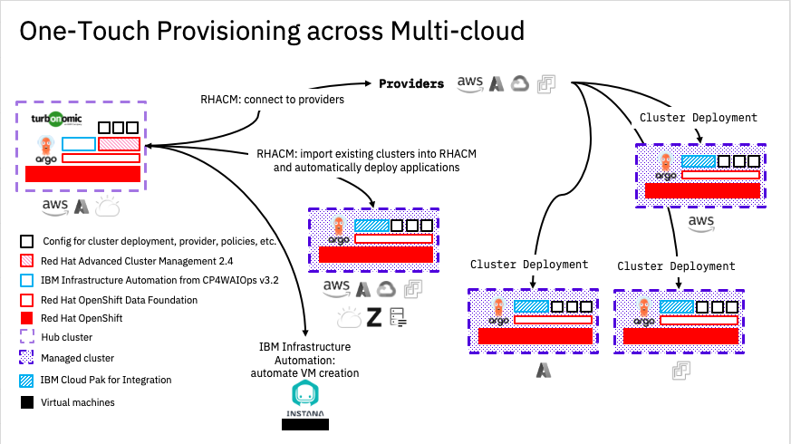
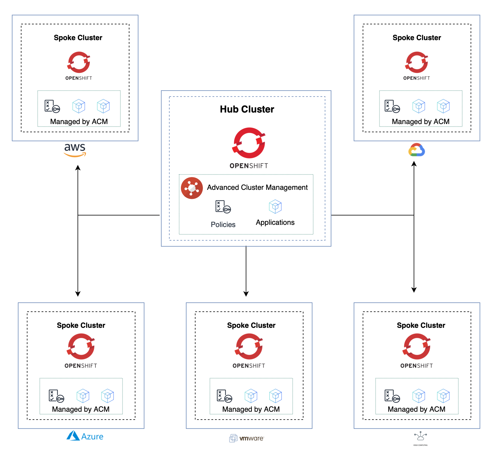

# GitOps for Advanced Cluster Management (ACM)

**One Touch Provisioning across Multi-Cloud** makes the deployment and maintenance of a multi-cloud environment beginning with the hitting of one big red button (figuratively). This starts provisioning a platform that provides:

- Cluster and Virtual Machine Provisioning capabilities
- Governance and policy management
- Observability of Clusters and workload
- Deployment of applications, such as IBM Cloud Paks, all within a single command.

The following illustration shows how the parts of the project work together.

This method/pattern is an opinionated implementation of the GitOps principles, using the latest and greatest tooling available.

## Business value

Codified, Repeatable and Auditable deployment of complex systems, such as Cloud Paks across multiple clusters.

## Red Hat Advanced Cluster Management Hub and Spoke Clusters Concept

The project leverages two Open Source technologies to underpin the functionality within this pattern. 

- ArgoCD (aka OpenShift Gitops) 
- Open Cluster Management (aka Red Hat Advanced Cluster Management or RHACM).

The following diagram shows the Hub and Spoke architecture.

## Next steps

See [One Touch Provisioning across Multi-Cloud](https://github.com/one-touch-provisioning/otp-gitops) on GitHub.
