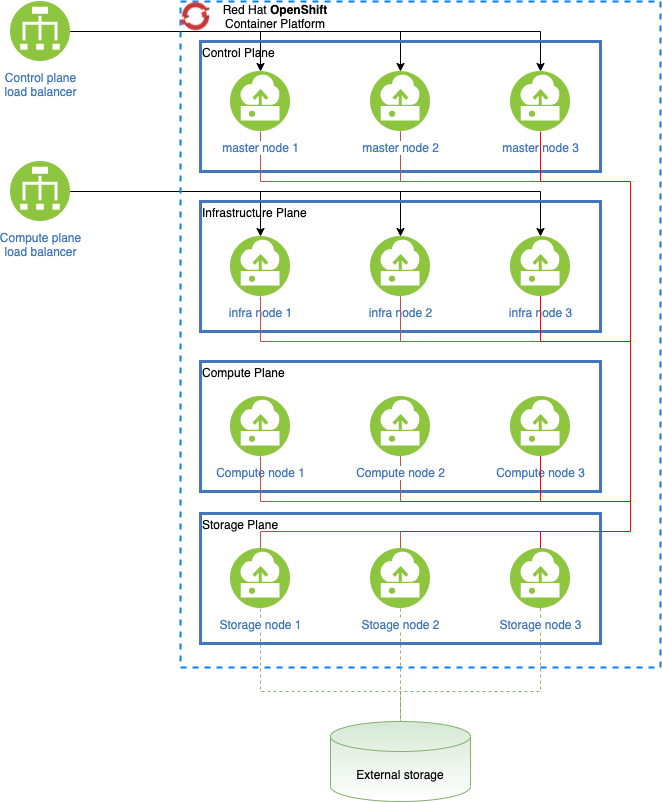

# Red Hat OpenShift Architecture Workshop

[IBM Academy of Technology Red Hat OpenShift solution design guidance](https://www.ibm.com/cloud/architecture/articles/ibmaot-redhat-openshift/red-hat-openshift-solution-design-guidance) provides step-by-step guidance to conduct an OpenShift Decision Workshop, including:

- Reference architectures
- Architecture decisions
- Capacity planning
- [Reference architectures](https://www.redhat.com/en/blog/openshift-container-platform-reference-architecture-implementation-guides)

The following diagram shows a sample on premises deployment reference architecture.

The common reference architecture is a great place to start. But clients will want a deeper understanding of the deployment and its capabilities.

## Red Hat Openshift deployment architecture

Here is a typical design pattern for Red Hat OpenShift solutions. In this pattern, the entire cluster (i.e., control plane, worker, infrastructure) exist in the same network zone.

The following conceptual deployment architecture showing three types of workloads:

- containerized workloads from IBM Cloud Paks deployed on the Red Hat OpenShift cluster
- containerized workloads from customer application microservices
- the workload from non-containerized enterprise applications hosted on regular VMs.

[Deployment architecture](./media/deployment-architecture.png)

The following operational model shows the physical view for a common deployment.

[Physical architecture](./media/physical-architecture-common.png)

## Architecture decision point guidance

Cloud Solution Architects need to make these critical decisions as part of every Red Hat® OpenShift® design.

- HA and DR
- Red Hat OpenShift Cluster Configuration
- Red Hat OpenShift Instance Size
- Oversubscription

Architecture decision points can help guide you through the decisions in deploying Openshift. Decisions rationale, motives, and considerations are explained for each decision:

AD-001 - Red Hat OpenShift Cluster Platform Node Type 
AD-002 - Hosting Platform 
AD-003 - Red Hat OpenShift Platform Selection 
AD-004 - Red Hat OpenShift Version 
AD-005 - Master Node Scheduling 
AD-006 - Cluster Workload Isolation 
AD-007 - Master Node High-Availability 
AD-008 - Application Availability 
AD-009 - Load Balancer Selection 
AD-010 - Multi-Region Red Hat OpenShift Cluster Deployment 
AD-011 - Container Registry 
AD-012 - Management Service Placement 
AD-013 - Worker Node OS 
AD-014 - Overcommitting Nodes 
AD-015 - Editing Kubelet Parameters 
AD-016 - Storage Technology for Red Hat OpenShift Cluster Platform Registry 
AD-017 - Storage Technology for Metrics & Logging 
AD-018 - Persistent Storage Options for Applications 
AD-019 - Production and Non-Production Co-Location 
AD-020 - Number of Installer Nodes 
AD-021 - Ingress Traffic for Applications 
AD-022 - High availability of UAT Environment

## Reference Cluster Configuration

When you install OpenShift, you may want to include Operators and funcationality, such as:

- OpenShift Container Storage
- Cluster Logging
- Git (using the Gitea operator)
- Jenkins
- OpenShift Pipelines
- OpenShift GitOps (for clusters at 4.7+)
- Quay
- Nexus Repository (Optional - Artifactory is another common choice)
- Red Hat Single Sign-on (Optional)
- Red Hat Service Mesh (Optional)
