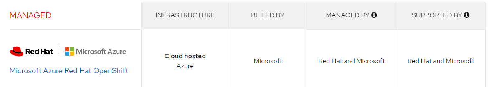

# Create a Azure RedHat OpenShift (ARO) cluster

In this tutorial, you will install Red Hat OpenShift on Azure (called ARO). You will install the resource group, virtual network, and ARO. Then you will connect to the cluster using the `oc` commands.

The following illustration shows the networking traffic routing of the default ARO installation.


## Features

Important distinctions of ARO:

- Red Hat, *billed by Microsoft*. 
- Supported by Red Hat and Mircosoft.
- Prometheus comes pre-installed and configured for Azure Red Hat OpenShift 4.x clusters. 



> IMPORTANT: <br />
> <br />
> - Check OpenShift version supported by ARO to be sure it is compatible with your use case.<br />
> - Check with your ATL to see if customers can use their IBM ELA for this installation or whether it is fully billed through Microsoft ELA.

## Set up

You will need:

- [Azure CLI](https://docs.microsoft.com/en-us/cli/azure/install-azure-cli-linux?pivots=apt&view=azure-cli-latest). 

On Linux you can use:

```sh
curl -sL https://aka.ms/InstallAzureCLIDeb | sudo bash
```

Or on Mac (or Linux or WSL2 with Brew) use:

```
brew update && brew install azure-cli
```

You will need Azure CLI version 2.6.0 or greater. Check using `az --version`

- **jq**. Use `sudo apt-get install -y jq`.  To check to see if it is installed use `which oc`
- **oc CLI** (Use either the Cloud Native Toolkit) `curl -sL shell.cloudnativetoolkit.dev | bash -` Or use the following:

```sh
cd ~
wget https://mirror.openshift.com/pub/openshift-v4/clients/ocp/latest/openshift-client-linux.tar.gz

mkdir openshift
tar -zxvf openshift-client-linux.tar.gz -C openshift
echo 'export PATH=$PATH:~/openshift' >> ~/.bashrc && source ~/.bashrc
```
To check to see if it is installed use `which oc`

IMPORTANT: You will also need:

- To create a resource group and resources, you must have either permissions for that scope. For example, to create the OCP cluster, you will need permissions on the resource group or subscription containing it:
    - **Contributor** and **User Access Administrator** permissions, or 
    - **Owner** permissions, either directly on the virtual network
- Sufficient Azure Active Directory permissions (either a member user of the tenant, or a guest user assigned with role **Application administrator**) for the tooling to create an application and service principal on your behalf for the cluster.}
- Permission to request help requests so that you can:
    - Increase the default number of cores to 40 vCPUs (for the minimum installation). An off-the-shelf Azure subscription limits the number of vCPUs to 10 (for your protection). Submit a help request in your **Subscriptions | Usage + Quotas** panel for the region you want to deploy to, as shown in the following illustration:

    

## Set environment variables

```sh
az login
az account subscription list

## select a subscription from the list and enter it on the next line
SUBSCRIPTION_ID="dcafb2cf-5c3b-49d0-969f-82dd18c4e466"
LOCATION="north central us"
RESOURCEGROUP="aro-nc-aro-project-1"
CLUSTER="cluster"
VNET_NAME="vnet-nc-aro-project-1"
```

## Create ARO

Follow instructions from [Tutorial: Create an Azure Red Hat OpenShift 4 cluster](https://docs.microsoft.com/en-us/azure/openshift/tutorial-create-cluster)

```sh
az account set --subscription $SUBSCRIPTION_ID
az vm list-usage -l $LOCATION \
  --query "[?contains(name.value, 'standardDSv3Family')]" \
  -o table
```

Responds with:

```text
CurrentValue    Limit    LocalName
--------------  -------  --------------------------
0               10       Standard DSv3 Family vCPUs
```

In the preceding case, you will need to file an help incident to request to increase your quota to 40.
You will need access to 40 vCPUs.

```
# you will need to only do this once for your CLI 
az provider register -n Microsoft.RedHatOpenShift --wait
az provider register -n Microsoft.Compute --wait
az provider register -n Microsoft.Storage --wait
az provider register -n Microsoft.Authorization --wait
```

## Get pull secret

1. Navigate to your [Red Hat OpenShift cluster manager portal](https://cloud.redhat.com/openshift/install/azure/aro-provisioned) and log in.
2. Click Download pull secret and download a pull secret to be used with your ARO cluster.


## Configure public DNS zone in Azure

Configure a DNS zone and ensure you delegate it to registrar. You can use Azure App service Domain or external internet domain registrar like GoDaddy. This is a critical step as the OpenShift installer tries to connect to OpenShift cluster using the DNS names that are created dynamically. Installation will fail if the DNS hostname are not resolved automatically.

IMPORTANT: By default, OpenShift uses self-signed certificates for all of the routes created on custom domains `*.apps.example.com`. 

You can use an App Service Doman (provided by Microsoft) for your testing purposes.


## Create resource group and virtual network

```sh
az group create \
  --name $RESOURCEGROUP \
  --location $LOCATION

## virtual network
az network vnet create \
  --resource-group $RESOURCEGROUP \
  --name $VNET_NAME \
  --address-prefixes 10.0.0.0/22

# control plane node subnet
az network vnet subnet create \
  --resource-group $RESOURCEGROUP \
  --vnet-name $VNET_NAME \
  --name master-subnet \
  --address-prefixes 10.0.0.0/23 \
  --service-endpoints Microsoft.ContainerRegistry

  az network vnet subnet create \
  --resource-group $RESOURCEGROUP \
  --vnet-name aro-vnet \
  --name worker-subnet \
  --address-prefixes 10.0.2.0/23 \
  --service-endpoints Microsoft.ContainerRegistry

## disable private endpoints on control plane subnet
az network vnet subnet update \
  --name master-subnet \
  --resource-group $RESOURCEGROUP \
  --vnet-name $VNET_NAME \
  --disable-private-link-service-network-policies true
```

NOTE: When you see the following error.

```text
Deployment failed. Correlation ID: 8d4dd186-abf4-48ad-b071-c7a66aa635c8. Resource quota of cores exceeded. Maximum allowed: 10, Current in use: 0, Additional requested: 36.
```

### Create cluster

You will need the Azure for Redhat Openshift provider installed for the following command to work. In the following case, I am using the [smaller VMs](https://docs.microsoft.com/en-us/azure/openshift/support-policies-v4#supported-virtual-machine-sizes) for my worker nodes.


```sh
az aro create \
  --resource-group $RESOURCEGROUP \
  --name $CLUSTER \
  --vnet $VNET_NAME \
  --master-subnet master-subnet \
  --worker-subnet worker-subnet \
  --master-vm-size Standard_D8s_v3 \
  --worker-vm-size Standard_F4s_v2 \
  --pull-secret @/mnt/c/Users/6J1943897/Downloads/pull-secret.txt
```

For more information on the parameters available, see [az aro create](https://docs.microsoft.com/en-us/cli/azure/aro?view=azure-cli-latest#az_aro_create) command line reference.

## Connect to ARO

Follow the instructions in the second section: [Tutorial: Connect to an Azure Red Hat OpenShift 4 cluster](https://docs.microsoft.com/en-us/azure/openshift/tutorial-connect-cluster)

```sh
az aro list-credentials \
  --name $CLUSTER \
  --resource-group $RESOURCEGROUP
```

Get the URL to the OpenShift console

```sh
az aro show \
    --name $CLUSTER \
    --resource-group $RESOURCEGROUP \
    --query "consoleProfile.url" -o tsv
```

## Connect to OpenShift server

To connect to the OpenShift server, use:

```sh
APISERVER=$(az aro show -g $RESOURCEGROUP -n $CLUSTER --query apiserverProfile.url -o tsv)

## Replace <kubeadmin password> with the password you just retrieved.
oc login $APISERVER -u kubeadmin -p <kubeadmin password>
```

## Delete cluster

To delete the cluster, use:

```sh
az aro delete --resource-group $RESOURCEGROUP --name $CLUSTER
```

## Security considerations

- [Active Directory integration](https://cloud.redhat.com/blog/openshift-blog-aro-aad)
- [Control egress traffic for your Azure Red Hat OpenShift (ARO) cluster (preview)](https://docs.microsoft.com/en-us/azure/openshift/howto-restrict-egress#:~:text=Create%20a%20private%20ARO%20cluster%201%20Set%20up,the%20cluster.%206%20Create%20a%20Firewall%20Subnet.%20)

## Configure StorageClass for RWX

For use with Cloud Paks and customer applications, you will want to dynamically provision [ReadWriteMany (RWX) storage](https://kubernetes.io/docs/concepts/storage/persistent-volumes/), which provides that your storage volume can be mounted as read-write by many nodes. 

You can use either *OpenShift Container Platform storage (OCS)* or *OpenShift Data Foundation (ODF)* Operators or set Azure Files for your StorageClass. 

> NOTE: OpenShift Container Storage (OCS) has been updated to OpenShift Data Foundation (ODF) starting with version OCP 4.9. For more information, see either:

- [OpenShift Container Platform storage overview](https://docs.openshift.com/container-platform/4.9/storage/index.html) 
- [Deploying OpenShift Data Foundation on Azure Red Hat OpenShift](https://access.redhat.com/documentation/en-us/red_hat_openshift_data_foundation/4.10/html/deploying_openshift_data_foundation_using_microsoft_azure_and_azure_red_hat_openshift/deploying-openshift-container-storage-on-azure-red-hat-openshift_aro).

OR if you prefer, you can set up Azure Files as your StorageClass. See [Create an Azure Files StorageClass on Azure Red Hat OpenShift 4](https://docs.microsoft.com/en-us/azure/openshift/howto-create-a-storageclass).

## Advanced reference

- [ARO Resource provider source code](https://github.com/Azure/ARO-RP)

## Next steps

Learn more about how to incorporate ARO into an existing Azure architecture. See [Control egress traffic for your Azure Red Hat OpenShift (ARO) cluster (preview)](https://docs.microsoft.com/en-us/azure/openshift/howto-restrict-egress) and how to incorporate Azure AD identities into OpenShift, see [Configure Azure Active Directory authentication for an Azure Red Hat OpenShift 4 cluster (CLI)](https://docs.microsoft.com/en-us/azure/openshift/configure-azure-ad-cli)

The following illustration shows how ARO can be configured inside a customer firewall.


