# Use Cloud Native Toolkit DevOps on ROKS instance, share with team members

[Cloud-Native Toolkit](https://develop.cloudnativetoolkit.dev/) is a collection of open-source assets that provide an environment for developing cloud-native applications for deployment within Red Hat OpenShift and Kubernetes. 

## Environment components

After installation, the environment consists of the following components and developer tools:

- A Red Hat OpenShift or IBM Cloud Kubernetes Service development cluster
- A collection of continuous delivery tools deployed into the cluster
- A set of backend services

This diagram illustrates the environment:

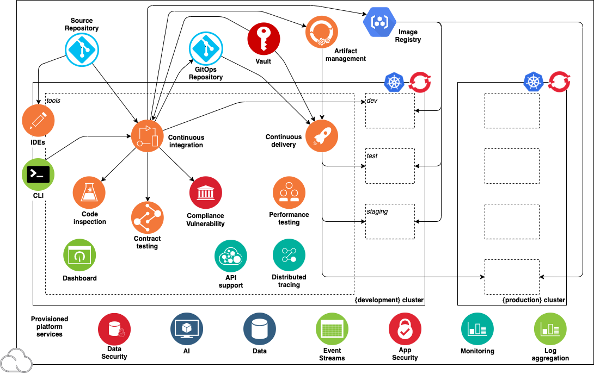

In this tutorial, learn how to set up the Cloud-Native Toolkit in your own OpenShift cluster running on IBM Cloud in TechZone. NOIE: The Skytap and Fyre instances do not provide a way to share the OpenShift instance with your team.

In this tutorial, you will:

1. Create an cluster of **IBM RedHat Openshift Kubernetes Service (ROKS)** 
2. Install the Cloud Native Toolkit into your ROKS cluster to provide the tools needed for your CI/CI pipeline.
3. Add [Artifactory](https://jfrog.com/artifactory/) as your HELM and container image repository.
4. Clone the sample repo of a React application into GitHub, then pull the sample from your GitHub to run locally. Run the app locally.
5. Set up the pipeline.
6. Check the pipeline is running.
7. Add team members join in working with the cluster.

You will want to use ROKS when you want to share your cluster with others on your team.

## Roles

The tutorial assumes you are an admin who deploys the cluster and developers who work within a project/namespace in the cluster.

When you create the OpenShift cluter in TechZone, you will become the admin for the cluster.

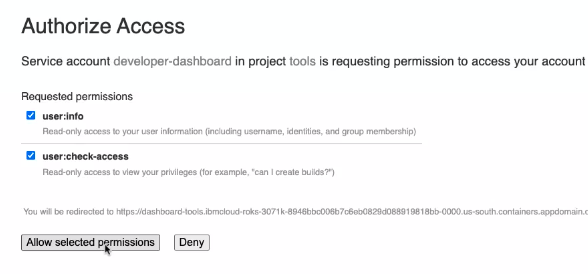

Team members can join as demonstrated in the last section of the tutorial.

## Prerequisites

You will need:

- IBMid
- Internal access to [TechZone](https://techzone.ibm.com) and understand how to create a reservation in TechZone.
- Git
- Github account and know how to clone your repo locally.

- The GitHub account [Personal Access Token](https://docs.github.com/en/github/authenticating-to-github/keeping-your-account-and-data-secure/creating-a-personal-access-token).
- [IBM Cloud CLI](https://github.com/upslopeio/ibm-cloud-garage-training/blob/ded6dee567039894a58ea8a1c585e6aa3c0a85ba/computer-setup/ibmcloud.md).
- If on Mac OS or Linux then you need to have curl installed. This is usually available from the Linux package manager or installed as part of the base operating system.
- For all operating systems **Node.js** needs to be installed.
- How to log into IBM Cloud and retrieve your login token. See [IBM Cloud Setup](https://github.com/upslopeio/ibm-cloud-garage-training/blob/main/computer-setup/ibmcloud.md)


Check to see that you have `ibmcloud` installed in your command line.

```sh
which ibmcloud
which oc
```

## Create a reservation in TechZone

In this step you will create a reservation in TechZone and add your team members.

Begin by creating a reservation in TechZone. Go to [TechZone](https://techzone.ibm.com), click **Environments** search in the s searchbox using `IBM RedHat Openshift Kubernetes Service (ROKS)`.

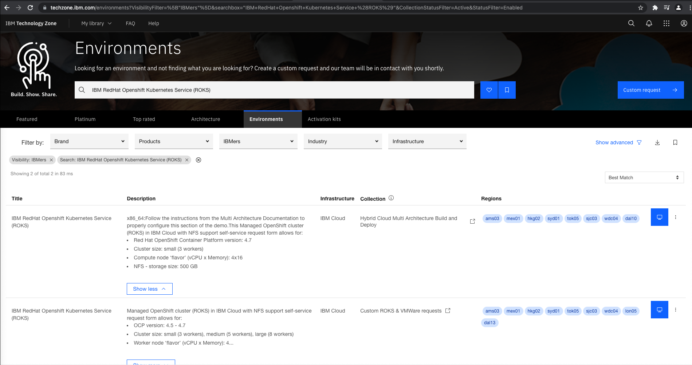

Click the computer icon on the line matching your requirementsm in this case, the **Hybrid Cloud** collection. 

Reserve your reservation with something similar to the following:

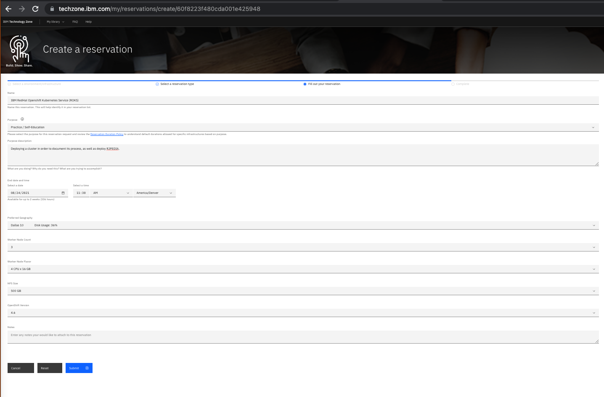

Select a **Preferred Geography** with some capacity available and **NFS Size** can be **none**.

Click **Submit**.

The IBM Cloud takes an hour or so to provision. 

Once provisioned, you can view your reservation by going to TechZone then use the **My library** along the top, then click **My reservations** menu item. The reservation will need to be in the **Provisioned** state to proceed.

### Get the OpenShift command line to log into the cluster

A few hours after asking for your cluster, it should be provisioned. Go to TechZone main page, click **My Library** menu at the top, click **My reservations**. Click the panel with your reservation to see the overview of the reservation.

Take note of the **Cloud Account**. This is the cloud account DTE uses to run your account. When you log into your cluster, you will use this identity to manage it.

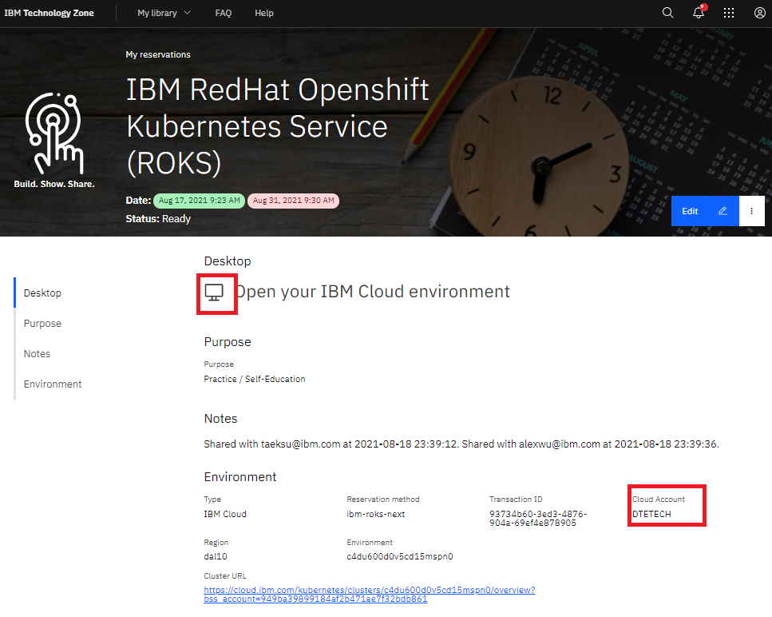

Click the cluster URL to go directly to the cluster. 

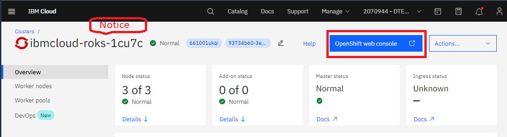

You will want to take note of the Cluster name that TechZone uses. If you have multiple clusters, you will want to know this name as the one created by DTE.

Click the blue **OpenShift web console** button. That brings you to:

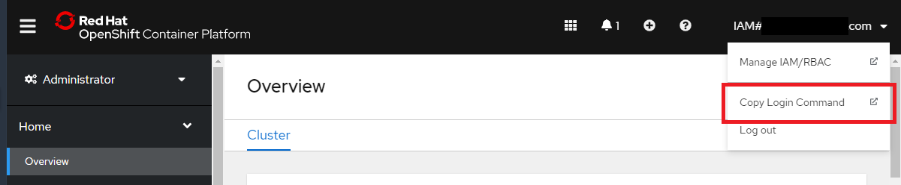

Click **IAM#yourlogin.com** and select **Copy Login Command** from the drop down menu.

Click **Display Token**, which is the only thing on the page.

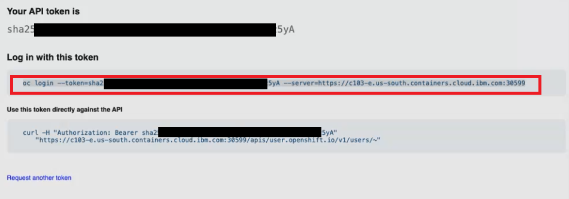

Copy the **Log in with this token** onto your clipboard.

You are ready to log into OpenShift from the command line.

### Log into the OpenShift from the command line

Log into the OpenShift from the command line. The following example shows using your key from the previous step.

```sh
oc login --token=sha256-XXXXXXXXXXXXX-iVs --server=https://c107-e.us-south.containers.cloud.ibm.com:32106 
```

IMPORTANT: Do not share your command line with other users, otherwise they will be executing commands in the cluster under your name and credentials.

## Set up the cluster using the Cloud Native Toolkit

Use the following command to set up your toolkit in the IBM Cloud cluster.

```sh
curl -sfL get.cloudnativetoolkit.dev | sh -
```

(If you want to set up a multi-user workshop, use `curl -sfL workshop.cloudnativetoolkit.dev | sh -` to set up your cluster. This will provision user names from `user01` to `user15` with a password of `password`, like you had in bootcamp). 

For more information, see [Setup Workshop Environment](https://cloudnativetoolkit.dev/resources/workshop/setup/). For more advanced set up, see [Prepare an IBM Cloud account](https://cloudnativetoolkit.dev/adopting/setup/ibmcloud-setup/).

You have completed setting up the Cloud Native Toolkit in your Open Stack cluster. 

Log into RedHat cluster, click on ninebox to see the list of tools that the toolkit installed.

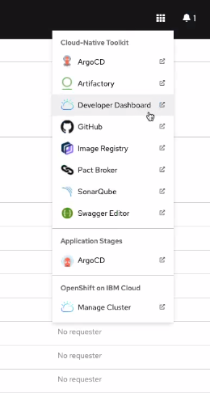

## Add Artifactory

Next, use the steps in Cloud Native Toolkit documentation to set up [Artifactory](https://cloudnativetoolkit.dev/adopting/admin/artifactory-setup/). 

Artifactory functions as the single source of truth for all packages, container images and Helm charts, as they move across the entire DevOps pipeline. It is similar to the repository we expect you to find at customer sites.

The installation seemlessly integrates Artifactory with OpenShift.

In a later step, you will build the container image and push it into Artifactory within the pipeline.

## Get the sample code for your React project

Next, let's install sample source code to put into the pipeline. In this case, use the React UI Sample code.

Log into RedHat cluster, click on ninebox, click Developer Dashboard.

Next click **Starter Kits**, then click **React UI Patterns** panel. This will ask to connect a repo, with a prepopulated code for everything you need. Name the repo `react-demo`. 

```sh
# set MYREPO environment variable to your repo url
MYREPO="https://yourgithubid/react-demo"
```

You have now cloned the React sample in your GitHub repo.

Next you will pull the repo to your local machine.

### Clone repo to your development computer

In this step, you clone the repo to your local development computer and run locally. The following script creastes a directory for your code and clones your repository.

```sh
MYCODE=$HOME/code
mkdir $MYCODE
cd $MYCODE
git clone $MYREPO
cd react-demo
```

Change directory into the demo

Set the version of Node. It must be version 12, because the template in React sample requires that version.

```
npm install -g n
sudo n 12
node -v
```

Returns the version number for **Node.js**, such as:

```
v12.22.5
```

Remove the **package-lock.json** from root and from `client` directories.

```sh
rm -rf package-lock.json
rm -rf client/package-lock.json
```

### Install NPM dependencies

```sh
npm  install
cd client
npm install
cd ..
npm run
```

You can now check the status of the application.

```sh
npm start
```

Use the URL that is returned to see the project running in your browser.

If this is running type `Ctrl-c` to continue build the pipeline.

You have now confirmed that the application is running as expected.

## Create the pipeline

Check to be sure you are in the correct directory.

```sh
ls
```

Should respond with the files and folders including `client` directory. If not, change directory to the root of your project.

To create the pipeline, you will take these steps:

1. Create a new project
2. Create the pipeline for the project in OpenShift
3. Check the console to see the pipeline runs successfully

Let's verify you are in the repo.

### Create a project

Create a project named `reactui-sample` in OpenShift using:

```sh
PROJECT_NAME=reactui-sample
oc sync $PROJECT_NAME
```

The commands set up the project, also creates the namespace in Kubernetes. The command replies:

```
Setting up namespace reactui-sample
Checking for existing project: reactui-sample
Creating project: rreactui-sample
Copying ConfigMaps
Copying Secrets
Setting current project to reactui-sample
```

NOTE: The project name must be lowercase or dashes or numbers, no capitals nor underscores.

### Create the pipeline

Create the pipeline, provide the GitHub authentication and select Tekton.

```sh
oc pipeline
```

Use the arrow key to select `Tekton`, and press `enter`.

The command prompts you for your GitHub username and use your Personal Access Token. (The password option has been disabled in GitHub.)

Use the arrow keys to select `ibm-nodejs` and press enter. 

Say `n` to **scan-image** and `y` for **lint-dockerfile**`**. The current build fails the image security scan due to its dependencies.

### Log into the console

The previous command replies:

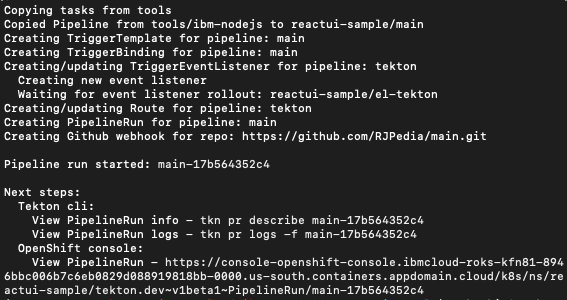

Select the URL after `View PipelineRun` and copy into your browser to see the pipeline run.

Log into the console to see the pipeline running successfully.

The console shows the pipeline working.

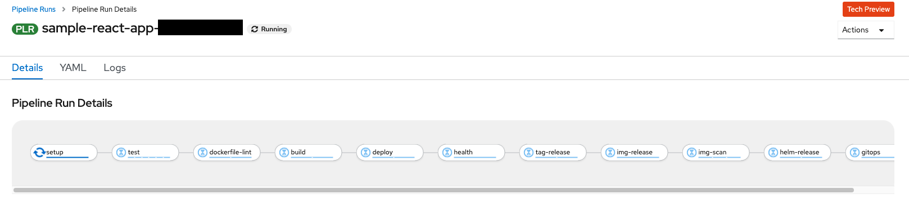

You have successfully created the pipeline and can share the project with other developers on your team who are granted permissions through TechZone.

## Add team members

*After your cluster is provisioned*, you can  provide access to the cluster for your team members.  

You will want to add team members who may want to view their executing code after the build process. To share the cluster with team members, first invite them from withing TechZone reservation and then the team members must accept the invitation. Once accepted, the cluster will one of their IBM Cloud clusters viewable within the IBM Cloud portal.

### Invite team members in TechZone reservation

Go to your reservation in TechZone, click on the `:` in the upper right of your reservation, the click **Share**.  

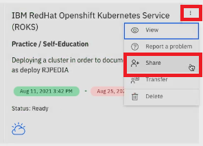

Fill in the dialog with the IBMid for each user, one at a time. The users should receive an invite by email to use cluster.

NOTE: You will not have permission to add users from within the TechZone/DTS provided subscription. You will need to invite team members through TechZone.

If for some reason your team member does not generate an email or notification for your user, contact `#dte-techzone-support` on Slack.

### Team members accept invitation

In a previous step, as admin you invited team members to join in your IBM Cloud account. As a team member, you must accept the invitation. The invitation is either:

- In your email from DTS. Open the email and click **Join now** link in the email.
- In your notifications in IBM Cloud, use the following steps:

    Team members log into the IBM cloud portal using your IBM account. Your users log into the cluster from [IBM Cloud Login](https://cloud.ibm.com/login) using their own IBMId credentials. 

    Click the Bell icon the upper menu. Select the notification for joining. Click on the **Join now.** link as shown in the following illustration.

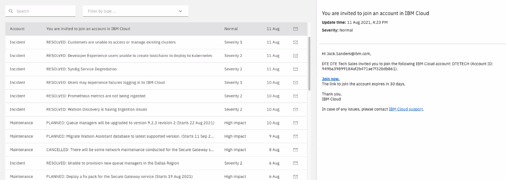

As administrator, you will need to provide the cluster name to your team members. But the team members should be able to see the cluster in their IBM Cloud. Navigate to the main IBM Cloud console page. 

Click **Clusters** under **Resource Summary** in the second set of panels from the top of the page.

Click the your cluster to get to the cluster portal page.

## References

- [Cloud Native Toolkit](https://cloudnativetoolkit.dev/)
- [Cloud Native Garage Method Boot Camp](https://github.com/upslopeio/ibm-cloud-garage-training/)

## Authors

- Taeksu Kim
- Alex Wu
- Jack Sanders
- Bruce Kyle

Aug 20, 2021
