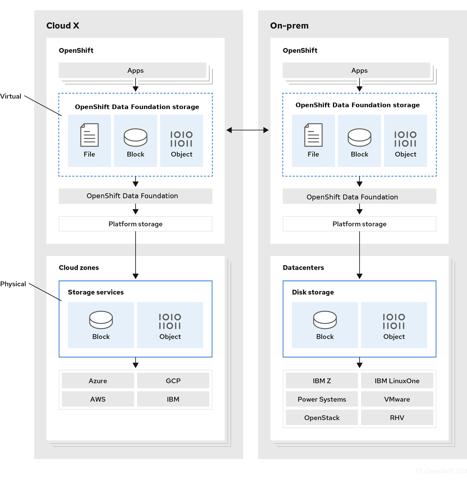

# Install OpenShift Data Foundation

[Red Hat OpenShift Data Foundation (ODF)](https://www.redhat.com/en/technologies/cloud-computing/openshift-data-foundation) — previously _Red Hat OpenShift Container Storage (OCS)_ — is software-defined storage for containers.

Red Hat OpenShift Data Foundation is a persistent storage solution for the OpenShift Container Platform that supports file, block, and object storage on-premises or in hybrid clouds. ODF is fully integrated with OpenShift Container Platform for deployment, management, and monitoring.

> Use **OpenShift Data Foundation** for OpenShift versions starting with version 4.9.

OpenShift Container Platform has been verified to work in conjunction with [localstorage](https://docs.openshift.com/container-platform/4.6/storage/persistent_storage/persistent-storage-local.html) devices and OpenShift Container Storage (OCS) on AWS EC2, VMware, Azure and Bare Metal hosts.

## OpenShift Data Foundation services 

Red Hat OpenShift Data Foundation services are primarily made available to applications by way of storage classes that represent the following components:

- **Block storage devices**, catering primarily to database workloads. Prime examples include Red Hat OpenShift Container Platform logging and monitoring, and PostgreSQL.
- **Shared and distributed file system**, catering primarily to software development, messaging, and data aggregation workloads. Examples include Jenkins build sources and artifacts, Wordpress uploaded content, Red Hat OpenShift Container Platform registry, and messaging using JBoss AMQ.
- **Multicloud object storage**, featuring a lightweight S3 API endpoint that can abstract the storage and retrieval of data from multiple cloud object stores.
- **On premises object storage**, featuring a robust S3 API endpoint that scales to tens of petabytes and billions of objects, primarily targeting data intensive applications. Examples include the storage and access of row, columnar, and semi-structured data with applications like Spark, Presto, Red Hat AMQ Streams (Kafka), and even machine learning frameworks like TensorFlow and Pytorch.

The following diagram shows the Red Hat OpenShift Data Foundation architecture:

For more information, see [Red Hat OpenShift Data Foundation architecture](https://access.redhat.com/documentation/en-us/red_hat_openshift_data_foundation/4.11/html/red_hat_openshift_data_foundation_architecture/introduction-to-openshift-data-foundation-4_rhodf).

Red Hat OpenShift Data Foundation supports deployment into Red Hat OpenShift Container Platform clusters deployed on:

- Installer Provisioned Infrastructure 
- User Provisioned Infrastructure

For details about these two approaches, see [OpenShift Container Platform - Installation process](https://access.redhat.com/documentation/en-us/openshift_container_platform/4.10/html-single/architecture/index#architecture-installation). 

### ODF Operators

Red Hat OpenShift Data Foundation is comprised of three Operator Lifecycle Manager (OLM) operator bundles, deploying four operators which codify administrative tasks and custom resources so that task and resource characteristics can be automated:

- OpenShift Data Foundation
    `odf-operator`

- OpenShift Container Storage
    `ocs-operator`
    `rook-ceph-operator`

- Multicloud Object Gateway
    `mcg-operator`

Administrators define the desired end state of the cluster, and the OpenShift Data Foundation operators ensure the cluster is either in that state or approaching that state, with minimal administrator intervention.

## Lab

For a lab on how to deploy OCS and ODF, see [Installation and Configuration](https://red-hat-storage.github.io/ocs-training/training/ocs4/odf.html).

## References

See

- [Installing OpenShift Container Storage](https://pages.github.ibm.com/dwakeman/random-thoughts/openshift/storage/ocs/) from Dave Wakeman
- Red Hat documentation: [ODF architecture](https://access.redhat.com/documentation/en-us/red_hat_openshift_data_foundation/4.11/html/red_hat_openshift_data_foundation_architecture/index)
- [OpenShift Container Storage](https://k21academy.com/openshift/openshift-container-storage/) for an quick high level view of how OCS and ODF works.

## Learn more

- [Storage patterns for Kubernetes](https://www.redhat.com/en/engage/kubernetes-containers-storage-s-201911201051) ebook.
