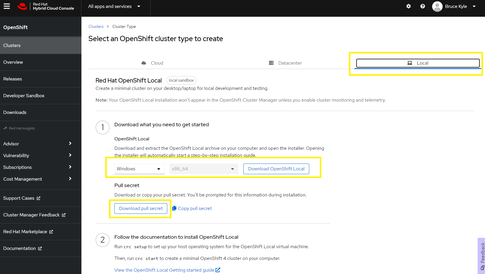

# Install OpenShift Local on Windows

**Red Hat OpenShift Local** brings a minimal OpenShift Container Platform 4 cluster and Podman container runtime to your local computer. These runtimes provide minimal environments for development and testing purposes. Red Hat OpenShift Local is mainly targeted at running on developers' desktops. 

1. Go to [cloud.redhat.com/openshift/install](https:cloud.redhat.com/openshift/install)
2. Sign in with your Red Hat username and password.
3. Select Run on Laptop.
4. Select your Operating System and select Download Code-Ready Containers. This will download a file such as crc-windows-amd64.zip.
5. Select Download pull secret. This will download a file such as pull-secret.txt.



Extract (unzip) `crc-windows-amd64.zip`. This will create a new folder, such as `crc-windows-<version>-amd64`. 

Run the installer application in the folder. Follow the prompts of the installer.

Run the following commands to set up CRC and then start.

```powershell
cd \
crc setup --log-level debug
Start-ScheduledTask -TaskName crcDaemon
crc start
```

NOTE: `Start-ScheduledTask -TaskName crcDaemon` fixes and issue where `crc setup` replies after several messages with `DEBU expected crcDaemon task to be in 'Running' but got 'Ready
'`

Follow the instructions at the end of `crc start`:

```
Started the OpenShift cluster.

The server is accessible via web console at:
  https://console-openshift-console.apps-crc.testing

Log in as administrator:
  Username: kubeadmin
  Password: PD6Ls-CpBG5-Y6ImF-6LyVY

Log in as user:
  Username: developer
  Password: developer

Use the 'oc' command line interface:
  PS> & crc oc-env | Invoke-Expression
  PS> oc login -u developer https://api.crc.testing:6443
```

## Set environment variables

Open PowerShell. Run

```powershell
cd \
crc oc-env
```

Then run each of the command shown.

```powershell
$Env.blah blah
```

## References

- [OpenShift - Install OpenShift CodeReady Containers on Windows](http://www.freekb.net/Article?id=2666)
- [Setting up Red Hat OpenShift Local](https://access.redhat.com/documentation/en-us/red_hat_openshift_local/2.2/html-single/getting_started_guide/index#setting-up_gsg)