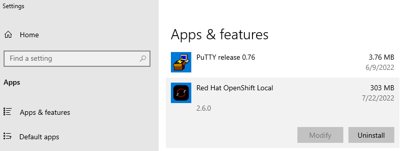

# Uninstall or Update OpenShift Local / Code Ready Containers (CRC) on Windows

You will need to uninstall OpenShift Local when you want to:

- Use Podman
- Update to a new version
- Remove to reset machine to known state

This assumes you have installed OpenShift CodeReady Containers on Windows. 

Close/Exit the CRC in the tool tray

To remove, use 

```powershell
crc.exe status
crc.exe stop
crc cleanup --log-level debug
crc.exe delete # C:\Program` Files\Red` Hat` OpenShift` Local\crc.exe delete
```

Then use **Apps & features** to uninstall Red Hat OpenShift Local.



You can then delete your user's hidden `.crc` directory, `C:\Users\john.doe\.crc`.

## Update

To update, reinstall. See  [Install OpenShift Local](./install).

## References

- [OpenShift - Uninstall OpenShift CodeReady Containers on Windows](http://www.freekb.net/Article?id=2672)
- [Upgrading Red Hat OpenShift Local](https://access.redhat.com/documentation/en-us/red_hat_openshift_local/2.14/html/getting_started_guide/installation_gsg#upgrading_gsg)