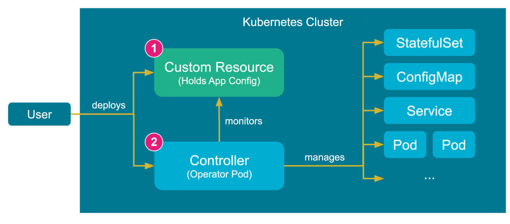
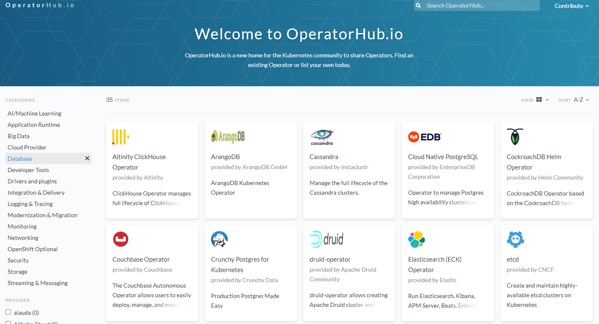
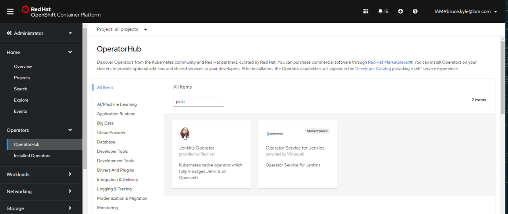

# Getting started with Operators in OpenShift

An Operator extends Kubernetes to automate the management of the entire life cycle of a particular application. Operators serve as a packaging mechanism for distributing applications on Kubernetes, and they monitor, maintain, recover, and upgrade the software they deploy. 

For context:

- _Manifests_ work great to manage stateless applications.
- _Operators_ make it easy to manage complex stateful applications on top of Kubernetes. 

## What are Operators?

[Operators are Kubernetes applications](https://coreos.com/blog/introducing-operator-framework). There are lots of ways to extend Kubernetes. In this tutorial, you will learn about Operators and custom resources.

[Operators](https://kubernetes.io/docs/concepts/extend-kubernetes/operator/) make it easy to _manage complex stateful applications_ on top of Kubernetes.

Operators allow you to write code to automate a task, beyond the basic automation features provided in Kubernetes. For teams following a DevOps or site reliability engineering (SRE) approach, operators were developed to put SRE practices into Kubernetes. 

[IBM Cloud Paks](https://www.ibm.com/cloud/paks) are collections of Operators that you install. Links at the end of the document gets you started in deploying Cloud Pak for Integration using Operators.

## Definitions

All Operators use the controller pattern, but not all controllers are Operators. 

It's only an Operator if it's got: 

> controller pattern + API extension + single-app focus.

A **Kubernetes operator** is an application-specific controller that extends the functionality of the Kubernetes API to create, configure, and manage instances of complex applications on behalf of a Kubernetes user.

It builds upon the basic Kubernetes resource and controller concepts, but includes domain or application-specific knowledge to automate the entire life cycle of the software it manages. 

A **custom resource** is the API extension mechanism in Kubernetes. A **custom resource definition (CRD)** defines a CR and lists out all of the configuration available to users of the operator. 

> Operator is a customized controller implemented with a CRD. It follows the same pattern as built-in controllers (i.e. watch, diff, action).

## How Does a Kubernetes Operator Work? 

Operators use controllers that monitor Kubernetes objects. These controllers are slightly different from regular Kubernetes controllers, because they track custom objects, known as custom resource definitions (CRDs). A CRD is an extension of the Kubernetes API that provides a place to store and retrieve structured data (the desired application state). 

Operators track cluster events related to specific types of custom resources. These custom resources can track three types of events:

- Add
- Update
- Delete

When the operator receives the information, it takes action to bring the Kubernetes cluster or external system to the desired state as part of the custom controller scaling cycle.

To summarize a Kubernetes operator’s workflow:

1. User makes changes to a CRD
2. The operator tracks the CRD and identifies change events
3. The operator reconciles the CRD state with the desired state
4. The operator adjusts cluster state to the desired state

The following illustration shows the steps Kubernetes uses in the Operator's workflow.



### Create a CRD

The manifest below shows an example CRD `crd.yaml`:

```yaml
apiVersion: apiextensions.k8s.io/v1beta1
kind: CustomResourceDefinition
metadata:
  name: appconfigs.stable.example.com
spec:
  group: stable.example.com
  versions:
    - name: v1
      served: true
      storage: true
  scope: Namespaced
  names:
    plural: appconfigs
    singular: appconfig
    kind: AppConfig
    shortNames:
    - ac
```
Run `kubectl create -f crd.yaml` to create the CRD.

To use the CRD, create a manifest using the kind we created with the CRD. For example `my-kind.yaml`:

```yaml
apiVersion: "stable.example.com/v1"
kind: AppConfig
metadata:
  name: demo-appconfig
spec:
  uri: "some uri"
  Command: "some command"
  image: my-image
```

To use the AppConfig, run `kubectl create -f my-kind.yaml`.

When you want to create your own custom resource resource definition, you will want to start with [Operator SDK].

## Operator Framework

The [Operator Framework](https://github.com/operator-framework) includes:

- **Operator SDK**: Enables developers to build operators based on their expertise without requiring knowledge of Kubernetes API complexities.
- **Operator Lifecycle Management**: Oversees installation, updates, and management of the lifecycle of all of the operators running across a Kubernetes cluster.
- **Operator Metering**: Enables usage reporting for operators that provide specialized services.

## Operator.io

**OperatorHub.io** is a new home for the Kubernetes community to share Operators. 



## RedHat OperatorHub

Red Hat has its own Operator Hub within OpenShift that are groups into [categories](https://docs.openshift.com/container-platform/4.6/operators/understanding/olm-understanding-operatorhub.html#olm-operatorhub-overview_olm-understanding-operatorhub):

- Red Hat Operators, supported by Red Hat
- Certified Operators, from ISVs
- Red Hat Marketplace, can be purchsed
- Community Operators with no official support
- Custom Operators, roll your own

The following illustration shows how to find the OpoeratorHub in the OpenShift portal.



## Operator lifecycle manager

*Operators* on *OperatorHub* are packaged to run on Operator Lifecycle Manager (OLM).

The level of sophistication of the management logic encapsulated within an Operator can vary. This logic is also in general highly dependent on the type of the service represented by the Operator.


## Prerequisites

You will need either:

- RedHat OpenShift on IBM Cloud (ROKS) cluster. You can use one from TechZone.
- Homebrew (yes it works on WSL2)
- `oc` installed locally.
- Must be cluster administrator or [allow non-cluster administrators to install Operators](https://docs.openshift.com/container-platform/4.6/operators/admin/olm-creating-policy.html#olm-creating-policy).
- [Operator SDK CLI](https://sdk.operatorframework.io/build/). Use `brew install operator-sdk`
- [Optional] Tree using `brew install tree` 

Kubernetes 1.17-1.21
OpenShift 3.11, 4.3-4.7

Log in to OpenShift.

## Install the Jenkins Operator using the UI

Jenkins Operator is a Kubernetes native operator which fully manages Jenkins on Openshift. It was built with immutability and declarative configuration as code in mind. It is meant to replace the Jenkins on Openshift Template as the primary source of deploying [Jenkins on Openshift](https://github.com/openshift/jenkins) while also easing the Operational work necessary to manage the Jenkins Instance(s) on an Openshift Cluster.

Out of the box it provides:

- Integration with Kubernetes
- Pipelines as code
- Extensibility via groovy scripts or configuration as code plugin
- Security and hardening
- Backup and restore

After you log in, use:

```sh
oc new-project test-jenkins
```

Go to OperatorHub and select Jenkins Operator. Fill in using the `test-jenkins` namespace.

Click **Installed Operators**. 
Click **Pods**.

To get the route to Jenkins

```sh
oc get svc
```

In the UI, in RedHat OpenShift Container Platform UI under Administrator, view the Deployments, Pods, Secrets (filter on `jenkins`).

Follow the example docs [here](https://github.com/openshift/origin/blob/master/examples/jenkins/README.md)

You now have Jenkins installed as an Operator with the Automatic strategy using the Operator Lifecycle Manager (OLM) to automatically update the Operator when a new version is available.

<!--
## Install the Compliance Operator

The [Compliance Operator](https://docs.openshift.com/container-platform/4.6/security/compliance_operator/compliance-operator-understanding.html) lets OpenShift Container Platform administrators describe the desired compliance state of a cluster and provides them with an overview of gaps and ways to remediate them. The Compliance Operator assesses compliance of both the Kubernetes API resources of OpenShift Container Platform, as well as the nodes running the cluster. The Compliance Operator uses [OpenSCAP](https://www.open-scap.org/), a NIST-certified tool, to scan and enforce security policies provided by the content.

Follow instructions to install the [Compliance Operator](https://docs.openshift.com/container-platform/4.6/security/compliance_operator/compliance-operator-installation.html) into OpenShift cluster.

After installing, you would run a scan. For more information, see [OpenShift Container Platform security and compliance](https://docs.openshift.com/container-platform/4.6/security/index.html).

For more information, start with [How does Compliance Operator work for OpenShift?](https://cloud.redhat.com/blog/how-does-compliance-operator-work-for-openshift-part-1) and [Red Hat OpenShift security guide](https://www.redhat.com/en/resources/openshift-security-guide-ebook) ebook.
-->

## Getting started to build a custom Operator with HELM

You can build your own custom operator. You would begin with the Operator SDK. 

`cd` into your directory and then use the following:

```sh
mkdir nginx-operator
cd nginx-operator
operator-sdk init --domain example.com --plugins helm
```

The code initializes a new project including vendor/ directory and Go package directories.

Writes the following files:

- Boilerplate license file
- PROJECT file with the domain and repo
- Makefile to build the project
- go.mod with project dependencies
- Kustomization.yaml for customizating manifests
- Patch file for customizing image for manager manifests
- Patch file for enabling prometheus metrics
- main.go to run

Create a simple nginx API using Helm’s built-in chart boilerplate (from helm create):

```sh
operator-sdk create api --group demo --version v1alpha1 --kind Nginx
```

Use `tree` to see what it created

```sh
tree
```

Open the crd base file for your new example:

```sh
nano config/crd/bases/demo.example.com_nginxes.yaml
```

For more information, see [Quickstart for Helm-based Operators](https://sdk.operatorframework.io/docs/building-operators/helm/quickstart/)

### Next step to create your custom Operator

See [Operator Reconciliation: "You can't always get what you want... or can you?"](https://ec.yourlearning.ibm.com/w3/event/10211965). See [Operator Framework tutorial](https://developer.ibm.com/tutorials/kubernetes-operators-framework/) in IBM documents.

## News

[Cassandra to Operator](https://thenewstack.io/we-pushed-helm-to-the-limit-then-built-a-kubernetes-operator/)

## Next steps

Try [Install, Configure and Expose MongoDB on IBM Cloud Pak for Data (ICP4D)](https://medium.com/@vrvignesh/install-configure-and-expose-mongodb-on-ibm-cloud-pak-for-data-icp4d-c1563ed84e70)

Try [Express installation of Cloud Pak for Integration](https://www.ibm.com/docs/en/cloud-paks/cp-integration/2020.4?topic=installing-express-installation)

## References

- [What are Operators?](https://docs.openshift.com/container-platform/4.6/operators/understanding/olm-what-operators-are.html) in OpenShift documentation
- [What is a Kubernetes operator?](https://www.redhat.com/en/topics/containers/what-is-a-kubernetes-operator) in RedHat documentation
- [CNCF Operator White Paper](https://github.com/cncf/tag-app-delivery/blob/eece8f7307f2970f46f100f51932db106db46968/operator-wg/whitepaper/Operator-WhitePaper_v1-0.md)
- O’Reilly ebook [Kubernetes Operators: Automating the Container Orchestration Platform](https://www.redhat.com/en/resources/oreilly-kubernetes-operators-automation-ebook)
- [Google Cloud about best practices for building Operators](https://cloud.google.com/blog/products/containers-kubernetes/best-practices-for-building-kubernetes-operators-and-stateful-apps)
- [Operator Framework](https://operatorframework.io/)
- [How to install TraderLite Operator](https://ibm.ent.box.com/notes/834684834815)
- From Aqua [Kubernetes Operators: How they Work and 6 Operators to Try](https://www.aquasec.com/cloud-native-academy/kubernetes-101/kubernetes-operators/)
- [Operator APIs](https://docs.openshift.com/container-platform/4.6/rest_api/operator_apis/operator-apis-index.html) for OpenShift
