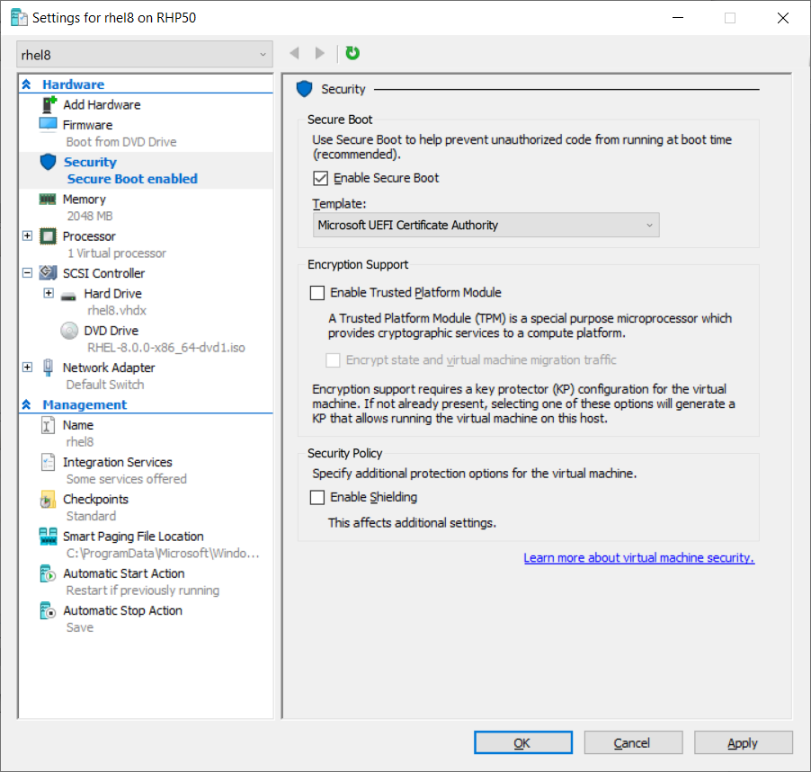

# Install Red Hat Enterprise Linux on Windows

You will need:

- [Hyper-V enabled](https://learn.microsoft.com/en-us/virtualization/hyper-v-on-windows/quick-start/enable-hyper-v).
- A Red Hat developer account. You will need this to register the system and attach it to your subscription. Completing these steps are required for your system to download software from Red Hat.
- The RHEL Binary `.iso` file. When you register and download through [developers.redhat.com](https://developers.redhat.com/products/rhel/download), a subscription will be automatically added to your account.
- A Windows system that:

    - can run Hyper-V, a 64-bit x86 machine with with hardware virtualization assistance (Intel VT-X or AMD-V) and Second Level Address Translation (SLAT).
    - has Hyper-V installed and the Hyper-V platform is enabled. For more information see Install Hyper-V on Windows 10 or consult the documentation for your version of Microsoft Windows. 
    - is equipped with has at least 8 GB of RAM and has at least 28 GB of available disk space for the VM and the .iso file.

For instructions on how to install Red Hat Enterprise Linux on Windows, see [RHEL 8 Hyper-V Quick Install](https://developers.redhat.com/rhel8/install-rhel8-hyperv#).

The following diagram shows the settings for RHEL in Hyper-V.



Some minor differences from the blog post in RHEL 9:

- 2 CPU is set up after you complete the New Virtual Machine Wizard. Set it in the Hyper-V when you set the **Security** feature.
- Set users at **Begin Installation**.
- Not sure how you eject installation media.
- To register, use your Red Hat id, not your email address associated with your Red Hat id.
- To run OpenShift Local, you will need 16 gigs of RAM.

## Run nested virtualization

From powershell, run

```
Set-VMProcessor -VMName <VMName> -ExposeVirtualizationExtensions $true
```

For more information, see [Configure Nested Virtualization](https://learn.microsoft.com/en-us/virtualization/hyper-v-on-windows/user-guide/nested-virtualization#configure-nested-virtualization).

## References

[RHEL 8 Hyper-V Quick Install](https://developers.redhat.com/rhel8/install-rhel8-hyperv#)
