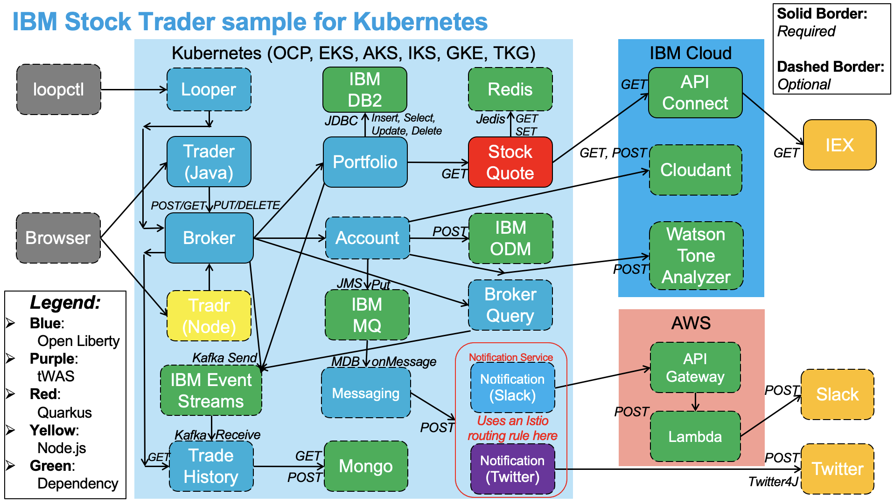

# Set up IBM Stock Trader demo

The IBMStockTrader application demonstrates how to build a cloud-native application out of a set of containerized microservices (each in their own repo under this org) that will run in Kubernetes. 

The IBM Stock Trader application is a simple stock trading sample where you can create various stock portfolios and add shares of stock to each for a commission. It keeps track of each porfolio's total value and its loyalty level which affects the commission charged per transaction. It sends notifications of changes in loyalty level. It also lets you submit feedback on the application which can result in earning free (zero commission) trades, based on the tone of the feedback.

The following diagram shows how the microservices fit together, and what external services (databases, messaging products, API/function services, etc.) they utilize.

Note that only the services with a solid border are mandatory - the rest are all optional, only installed when you want to enable additional bells and whistles.

## Install using HELM

See [General preparation for installation](https://github.com/IBMStockTrader/stocktrader-helm#general-preparation-for-installation)

### Prerequisites

The prerequisites for deploying the HELM operator and the operator in the next section are explained here:

- [Install and configure DB2](https://github.com/IBMStockTrader/stocktrader-helm#install-and-configure-db2)
- [Install and configure MQ](https://github.com/IBMStockTrader/stocktrader-helm#install-and-configure-mq)
- [Install and configure ODM](https://github.com/IBMStockTrader/stocktrader-helm#install-and-configure-odm)
- [Install and configure Redis](https://github.com/IBMStockTrader/stocktrader-helm#install-and-configure-redis)
- [Install and configure Tone Analyzer](https://github.com/IBMStockTrader/stocktrader-helm#install-and-configure-tone-analyzer)
- [Install stock API with API Connect](https://github.com/IBMStockTrader/stocktrader-helm#install-stock-api-with-api-connect)

### Install stocktrader Helm chart

See [Install stocktrader Helm chart](https://github.com/IBMStockTrader/stocktrader-helm#install-stocktrader-helm-chart)

## Install using an operator

The [IBM Stock Trader Operator](https://github.com/IBMStockTrader/stocktrader-operator) is a simple stock trading sample where you can create various stock portfolios and add shares of stock to each for a commission.

It keeps track of each porfolio's total value and its loyalty level which affects the commission charged per transaction. It is a derivation of IBM Stock Trader sample.

### Capabilities

This operator is intended to install all of the microservices from the IBM Stock Trader sample, and configure them to talk to services they require.

The operator can be deployed on IBM Cloud and other hyperscalers.

### Prerequisites

You will need an instance of DB2, and API Connect to run. Additional features may require additional features in Cloud Pak for Integration.  

To build it from scratch, you will need the [Operator SDK](https://docs.openshift.com/container-platform/4.3/operators/operator_sdk/osdk-helm.html).

### Build

You can build the operator yourself or you can use the one developed in [DockerHub](https://hub.docker.com/r/ibmstocktrader/stocktrader-operator).

Deploy the operator, and its CRD that you will need to do a bit of hand editing as shown in [the documentation](https://github.com/IBMStockTrader/stocktrader-operator).

Once you install the operator, you can use the OpenShift UI to edit the features of Stock Trader you want to use.

## References

- Outdated but useful: [Using an umbrella helm chart to deploy the composite IBM Stock Trader sample](https://medium.com/hybrid-cloud-engineering/using-an-umbrella-helm-chart-to-deploy-the-composite-ibm-stock-trader-sample-3b8b69af900d)