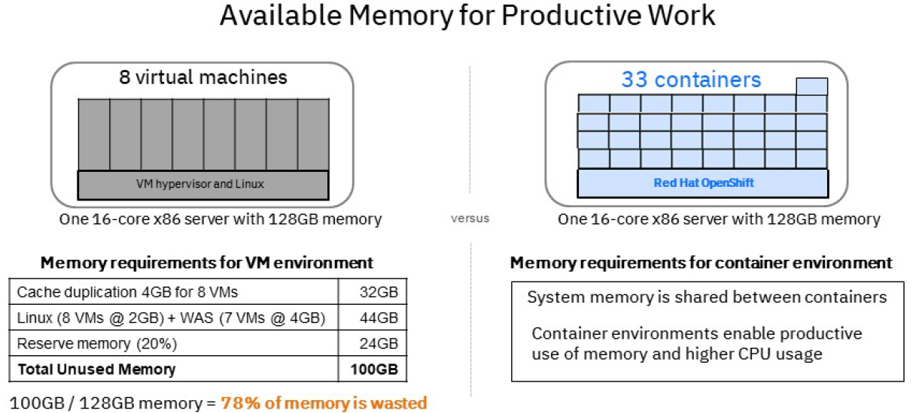
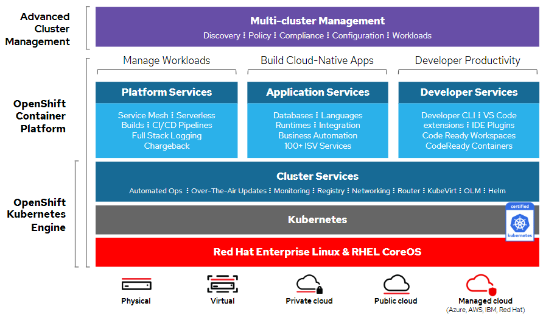
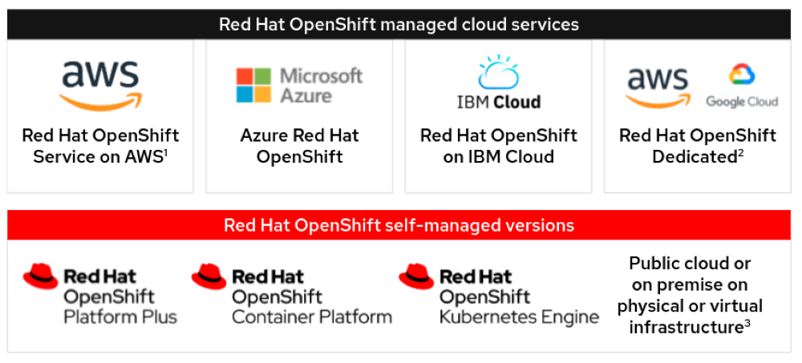

# Red Hat Openshift business value

_Containers_ is the way to deploy applications into production into data centers. Containers offers several key advantages over deploying applications into virtual machines. From a [developer point of view](https://developers.redhat.com/blog/2017/07/27/6-reasons-why-i-started-using-containers), containers are the answer, because:

- Containers are simple
- Containers are lightweight
- With containers, I can avoid the "works on my machine" effect
- There is a large community about containers
- Containers are extensible
- Containers are Cloud-ready

## Data center efficiency

In the data center -- the same way server virtualization capitalized physical machines, containers enable capitalization of virtual machines (VMs), resulting in a significant reduction in overhead and improved efficiency of the underlying hardware.

The following diagram shows a comparison of memory efficiency for production workloads:

For more information, see [Legacy VM to Container Sizing for Red Hat OpenShift](https://pages.github.ibm.com/IBMAoT/i-openshift-guides/02-solutions-guide/capacity-planning/legacy-vm-to-container/)

## How do you orchestrate lots of containers?

But how do you _orchestrate_ containers at scale -- in your data center?

[Container orchestration](https://www.ibm.com/cloud/learn/container-orchestration) software automates containers and lets developers configure them.

Several solutions to how to automate the number, sizing, and networking for container, but over time Kubernetes won.

Yet --

## Kubernetes is complex

Let's start with the [CNCF Cloud Native Interactive Landscape](https://landscape.cncf.io/). And doing it right means selecting and implementing many of the technologies shown in the diagram. 

Kubernetes done right is hard.

| Install | Deploy | Harden | Operate |
|-|-|-|-|
| - Templating - Validation - OS Setup | - Identity, security access - App monitoring, alerts - Storage, persistence - Egress, ingress, integration  - Host container images - Build/Deploy methodology | - Platform monitoring, alerts - Metering, chargeback - Platform security hardening - Image hardening - Security certifications - Network policy - Disaster recovery -Resource segmentation | - OS upgrade, patch - Platform upgrade, patch - Image upgrade, patch - App updrade, patch - Security patches - Continuous security scanning - Multli envrionment rollout - Enterprise container registry - Cluster and app elasticity - Montior, alert, remediate - Log aggregation|

## OpenShift is built on top of Kubernetes

OpenShift provides value added features, selected open source Cloud Native solution and ties them together as a supported platform.

OpenShift IS Kubernetes, 100% Certified by the CNCF. Certified Kubernetes is at the core of OpenShift. Users of `kubectl` love its power, once they are done with the learning curve. Users transitioning from an existing Kubernetes Cluster to OpenShift frequently point out how much they love redirecting their kubeconfig to an OpenShift cluster and have all of their existing scripts work perfectly. 

For more information, see [A Guide to Enterprise Kubernetes with OpenShift](https://cloud.redhat.com/blog/enterprise-kubernetes-with-openshift-part-one)

OpenShift adds values to Kubernetes by selecting key technologies that make the orchestration of containers more secure, scalable, and friendly to developers.

## OpenShift offers managed and self-managed options across multiple clouds

Red Hat offers both managed services and self-managed options, giving you the flexibility to choose where and how to deploy Red Hat OpenShift to meet your needs—supported by the same foundation of Red Hat Enterprise Linux® and core Kubernetes.

For a comparision of managed and self-managed options, see [Red Hat OpenShift: Container technology for hybrid cloud](https://www.redhat.com/en/resources/openshift-portfolio-datasheet).

## OpenShift features

OpenShift is a cloud-based container orchestration platform that runs on Linux and includes multiple additional features and access controls, which some businesses may deem more important.

The platform is designed to support better scaling and efficiency for cloud-based development on IBM, Amazon and other enterprise cloud services.

Key features of OpenShift are:

- CI/CD pipeline definitions are standardized for easier integration and scaling
- Includes default container automation tools
- Offers the Kubernetes' command line interface (CLI), “kubect1” in addition to “oc,” OpenShift's CLI
- OpenShift has become an integral building-block to application development because of its ease of compatibility with most cloud platforms
- Enables easy migration of container applications to the cloud
- Supports Kubernetes features and the Kubernetes platform, but with greater security features
- Builds upon line stability and user access with comprehensive route and access controllers
- Security features align with compliance regulations
- Technical support for production environments

## Key value adds by OpenShift

OpenShift provides an _opinionated_ set of technology that are add-ons to Kubernetes -- things you need to do to support Kubernetes that are not available in the box. OpenShift provides a matched set (versioned to work together) of key technologies to make Kubernetes safe and scalable in production environments.

Some of the features have been adopted by the Kubernetes itself or are part of CNCF projects. 

Here are key features that OpenShift provides out-of-the-box that provide for production-ready Kubernetes:

- [Routes](https://cloud.redhat.com/blog/kubernetes-ingress-vs-openshift-route) that enabling external access to services, but is easier to implement than Ingress object. Routes also work with the built in load balancer or you can bring your own, such as NGINX, NGINX Plus, or F5 BIG-IP. 
- [Project](https://docs.openshift.com/enterprise/3.0/architecture/core_concepts/projects_and_users.html) provides additional annotations to the Kubernetes namesapce. Projects have:

    - Objects. Pods, services, replication controllers, etc.
    - Policies. Rules for which users can or cannot perform actions on objects.
    - Constraints. Quotas for each kind of object that can be limited.
    - Service accounts. Service accounts act automatically with designated access to objects in the project.

- [Operators](https://www.redhat.com/en/technologies/cloud-computing/openshift/what-are-openshift-operators) and an operator library. Operators automate the creation, configuration, and management of instances of Kubernetes-native applications. Operators provide automation at every level of the stack—from managing the parts that make up the platform all the way to applications that are provided as a managed service. Cloud Paks are delivered as Operators.
- [Service mesh](https://www.redhat.com/en/technologies/cloud-computing/openshift/what-is-openshift-service-mesh) based on the [Istio](https://istio.io/latest/) that provides a uniform way to connect, manage, and observe microservices-based applications. Connect services securely by default with transparent TLS encryption. Enforce a "zero trust" or "need to know" network security model with fine-grained traffic policies based on application identities. 
- [CoreOS control plane](https://cloud.redhat.com/blog/red-hat-enterprise-linux-coreos-customization) as the base operating system that is immutable. 

    - RHCOS provides controlled immutability: Many parts of the system can be modified only through specific tools and processes.
    - _OpenShift nodes are remotely managed by the cluster itself._ The administrator does not need to deploy upgrades or patches to the node: The nodes are updated by the cluster itself.
    - The operating system starts from a generic disk image which is customized on the first boot via a process named Ignition.
    - RHCOS can be customized with uses JSON formatted files to define the customization information.

- Containers can not get root access. But you can debug and [investigate pod issues](https://docs.openshift.com/container-platform/4.6/support/troubleshooting/investigating-pod-issues.html) without it.
- [CI/CD pipeline](https://docs.openshift.com/container-platform/4.6/pipelines/understanding-openshift-pipelines.html) that is relatively easy to deploy.
- [Secure the build process](https://docs.openshift.com/container-platform/4.6/security/container_security/security-build.html) to nsures that the product of the build process is exactly what is deployed in production.
- Use [Tekton Chains for OpenShift Pipelines supply chain security](https://docs.openshift.com/container-platform/4.9/cicd/pipelines/using-tekton-chains-for-openshift-pipelines-supply-chain-security.html) to manage the supply chain security of the tasks and pipelines.
- Configure [identity providers](https://docs.openshift.com/container-platform/4.6/authentication/managing-security-context-constraints.html) such as LDAP, request header, GitHub, GitLab, OpenID Connect.
- [Storage](https://docs.openshift.com/container-platform/4.6/storage/index.html). OpenShift Container Platform uses a pre-provisioned storage framework called persistent volumes (PV) to allow cluster administrators to provision persistent storage. Use [Dynamic Provisioning](https://docs.openshift.com/container-platform/4.6/storage/dynamic-provisioning.html#dynamic-provisioning) to create storage volumes on-demand, eliminating the need for cluster administrators to pre-provision storage.
- [Network policy](https://docs.openshift.com/container-platform/4.6/networking/network_policy/about-network-policy.html) for you to restrict traffic to pods in your cluster. 
- [Monitoring stack](https://access.redhat.com/documentation/en-us/openshift_container_platform/4.9/html-single/monitoring/index) based on [Prometheus](https://prometheus.io/) and its wider ecosystem. The monitoring stack includes the following: Default platform monitoring components and Components for monitoring user-defined projects.

## Managed Services

Deploy Kubernetes more easily with Red Hat OpenShift managed services
Optimized to improve developer productivity and promote innovation, Red Hat® OpenShift® is an enterprise-ready Kubernetes container platform with full-stack automated operations for managing hybrid cloud, multicloud, and edge deployments. Four Red Hat OpenShift managed cloud services are available, so you can choose the option that best fits your organization’s needs. 

| Managed service | Runs on... | Managed and supported by... | Billed through... |
| - | - | - | - |
| Red Hat OpenShift Dedicated	| AWS or Google Cloud	| Red Hat	| Red Hat for Red Hat OpenShift use and AWS or Google Cloud for cloud use |
| Red Hat OpenShift Service on AWS	| AWS	| Red Hat and AWS	| AWS | 
| Azure Red Hat OpenShift	| Microsoft Azure	| Red Hat and Microsoft	| Microsoft |
| Red Hat OpenShift on IBM Cloud	| IBM Cloud	| Red Hat (support) and IBM (support and management)	| IBM |

Each service offers more than just access to managed software and technologies. They provide complete, full-stack environments with all necessary services, simple self-service use options, and expert 24x7 support via stringent service level agreements (SLAs).

For more information, see [Achieve more with Red Hat OpenShift managed services](https://www.redhat.com/en/resources/openshift-managed-services-cost-savings-brief)

## Next steps

See:

- Sales Play guide [Red Hat Ansible and OpenShift](https://ibm.seismic.com/Link/Content/NC64BhV8G7mDTGCDVQDDh9TTH9XV)

## References

- White paper: [Business value of Red Hat OpenShift](https://www.redhat.com/en/resources/The-Business-Value-of-Red-Hat-OpenShift). This white paper shares the survey findings, which include 636% ROI over five-years and the ability to ship almost 3 times more new features. The whitepaper details how the organizations achieved annual value worth an average of $10.59 million.
- [Red Hat OpenShift Solution Design Guidance: Deliverables, OpenShift Value Proposition, and OpenShift 4.4 Key Features.pdf](https://ibm.ent.box.com/s/ly46f6o1gk6funx3fwyvpgkj0sq1jksu/file/672740634677)
- [Red Hat OpenShift Solution Design Guidance: OpenShift Value Proposition](https://pages.github.ibm.com/IBMAoT/i-openshift-guides/02-solutions-guide/openshift-value-proposition/it-challenges/)
- Ebook: [Red Hat OpenShift security guide](https://www.redhat.com/en/resources/openshift-security-guide-ebook)

## Contributors

- Lorraine Conway
- [IBM Cloud Education](https://www.ibm.com/cloud/learn/education)
- Red Hat OpenShift documentation

## Updated

Aug 2022